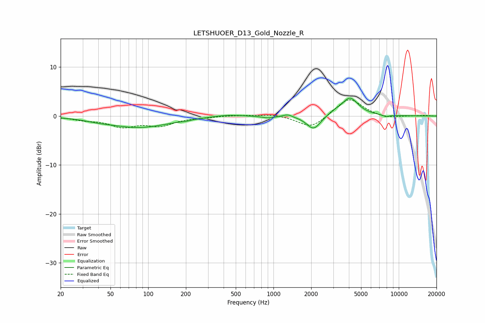

# LETSHUOER_D13_Gold_Nozzle_R
See [usage instructions](https://github.com/jaakkopasanen/AutoEq#usage) for more options and info.

### Parametric EQs
Apply preamp of -3.7 dB when using parametric equalizer.

|   # | Type    |   Fc (Hz) |    Q |   Gain (dB) |
|-----|---------|-----------|------|-------------|
|   1 | Peaking |        40 | 1.48 |        -0.3 |
|   2 | Peaking |        84 | 0.59 |        -2.3 |
|   3 | Peaking |       199 | 4.01 |        -0.2 |
|   4 | Peaking |       427 | 1.23 |         0.4 |
|   5 | Peaking |       907 | 2.94 |        -0.4 |
|   6 | Peaking |      1299 | 4.04 |         0.5 |
|   7 | Peaking |      2092 | 2.56 |        -2.9 |
|   8 | Peaking |      3018 | 3.39 |         0.5 |
|   9 | Peaking |      4070 | 2.11 |         3.7 |
|  10 | Peaking |      7912 | 5.32 |        -0.4 |

### Fixed Band EQs
When using fixed band (also called graphic) equalizer, apply preamp of **-3.4 dB** (if available) and set gains manually with these parameters.

|   # | Type    |   Fc (Hz) |    Q |   Gain (dB) |
|-----|---------|-----------|------|-------------|
|   1 | Peaking |        31 | 1.41 |        -0.7 |
|   2 | Peaking |        62 | 1.41 |        -2   |
|   3 | Peaking |       125 | 1.41 |        -1.8 |
|   4 | Peaking |       250 | 1.41 |        -0.2 |
|   5 | Peaking |       500 | 1.41 |         0.2 |
|   6 | Peaking |      1000 | 1.41 |         0.4 |
|   7 | Peaking |      2000 | 1.41 |        -2.6 |
|   8 | Peaking |      4000 | 1.41 |         3.8 |
|   9 | Peaking |      8000 | 1.41 |        -0.5 |
|  10 | Peaking |     16000 | 1.41 |         0.1 |

### Graphs

