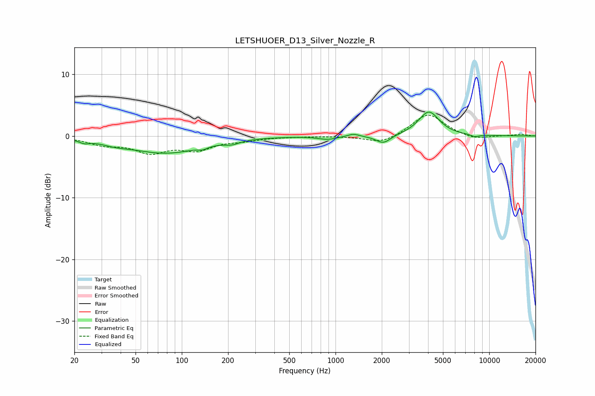

# LETSHUOER_D13_Silver_Nozzle_R
See [usage instructions](https://github.com/jaakkopasanen/AutoEq#usage) for more options and info.

### Parametric EQs
Apply preamp of -4.0 dB when using parametric equalizer.

|   # | Type    |   Fc (Hz) |    Q |   Gain (dB) |
|-----|---------|-----------|------|-------------|
|   1 | Peaking |        23 | 4.17 |        -0.5 |
|   2 | Peaking |        37 | 1.74 |        -0.5 |
|   3 | Peaking |        78 | 0.6  |        -2.7 |
|   4 | Peaking |       137 | 5.05 |        -0.4 |
|   5 | Peaking |       213 | 3.15 |        -0.5 |
|   6 | Peaking |       891 | 2.37 |        -0.5 |
|   7 | Peaking |      1306 | 3.93 |         0.4 |
|   8 | Peaking |      2046 | 2.95 |        -1.4 |
|   9 | Peaking |      4046 | 2.09 |         3.9 |
|  10 | Peaking |      8051 | 4.92 |        -0.4 |

### Fixed Band EQs
When using fixed band (also called graphic) equalizer, apply preamp of **-3.5 dB** (if available) and set gains manually with these parameters.

|   # | Type    |   Fc (Hz) |    Q |   Gain (dB) |
|-----|---------|-----------|------|-------------|
|   1 | Peaking |        31 | 1.41 |        -1.2 |
|   2 | Peaking |        62 | 1.41 |        -2.4 |
|   3 | Peaking |       125 | 1.41 |        -2   |
|   4 | Peaking |       250 | 1.41 |        -0.6 |
|   5 | Peaking |       500 | 1.41 |        -0.1 |
|   6 | Peaking |      1000 | 1.41 |        -0   |
|   7 | Peaking |      2000 | 1.41 |        -1.3 |
|   8 | Peaking |      4000 | 1.41 |         3.7 |
|   9 | Peaking |      8000 | 1.41 |        -0.7 |
|  10 | Peaking |     16000 | 1.41 |         0.3 |

### Graphs

