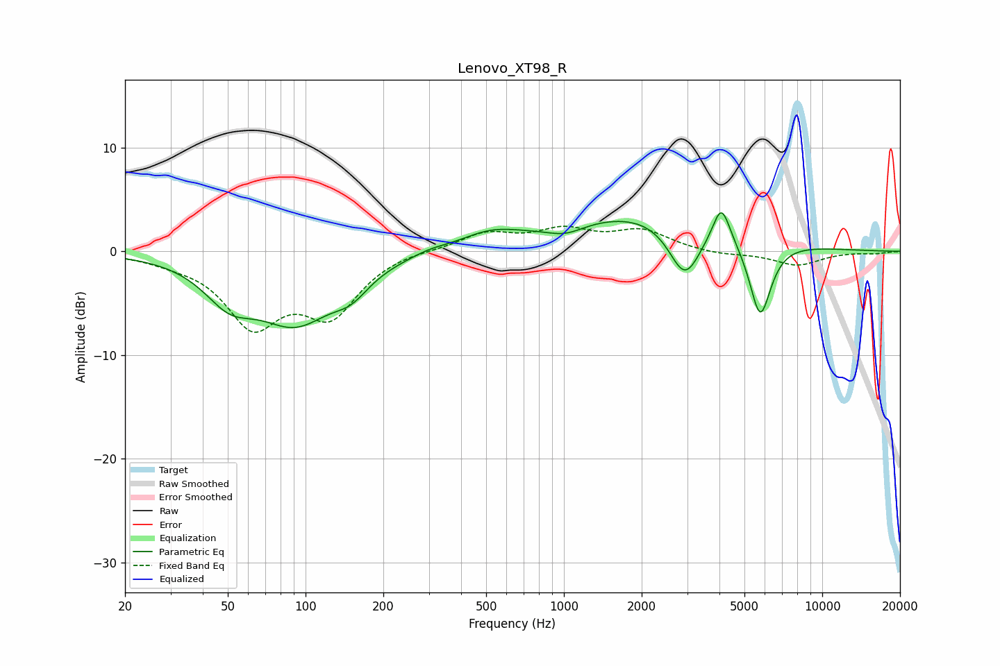

# Lenovo_XT98_R
See [usage instructions](https://github.com/jaakkopasanen/AutoEq#usage) for more options and info.

### Parametric EQs
Apply preamp of -3.8 dB when using parametric equalizer.

|   # | Type    |   Fc (Hz) |    Q |   Gain (dB) |
|-----|---------|-----------|------|-------------|
|   1 | Peaking |        51 | 1.47 |        -3.3 |
|   2 | Peaking |        91 | 0.92 |        -6.3 |
|   3 | Peaking |       150 | 2.02 |        -1.8 |
|   4 | Peaking |       302 | 2.22 |         0.3 |
|   5 | Peaking |       518 | 1.2  |         1.4 |
|   6 | Peaking |      1015 | 1.96 |        -0.9 |
|   7 | Peaking |      2143 | 0.42 |         3.8 |
|   8 | Peaking |      2938 | 2.25 |        -5.4 |
|   9 | Peaking |      4071 | 4.24 |         3.7 |
|  10 | Peaking |      5753 | 3.22 |        -7.6 |

### Fixed Band EQs
When using fixed band (also called graphic) equalizer, apply preamp of **-2.5 dB** (if available) and set gains manually with these parameters.

|   # | Type    |   Fc (Hz) |    Q |   Gain (dB) |
|-----|---------|-----------|------|-------------|
|   1 | Peaking |        31 | 1.41 |        -0.5 |
|   2 | Peaking |        62 | 1.41 |        -6.6 |
|   3 | Peaking |       125 | 1.41 |        -5.6 |
|   4 | Peaking |       250 | 1.41 |         0.2 |
|   5 | Peaking |       500 | 1.41 |         1.7 |
|   6 | Peaking |      1000 | 1.41 |         1.8 |
|   7 | Peaking |      2000 | 1.41 |         1.9 |
|   8 | Peaking |      4000 | 1.41 |        -0.3 |
|   9 | Peaking |      8000 | 1.41 |        -1.3 |
|  10 | Peaking |     16000 | 1.41 |        -0.2 |

### Graphs

