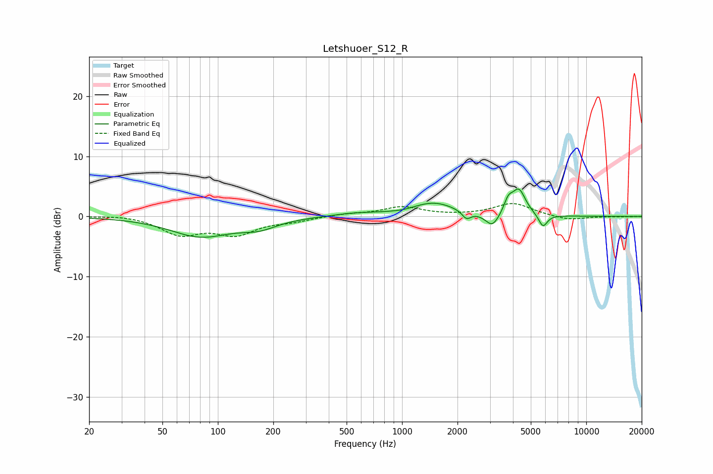

# Letshuoer_S12_R
See [usage instructions](https://github.com/jaakkopasanen/AutoEq#usage) for more options and info.

### Parametric EQs
Apply preamp of -4.7 dB when using parametric equalizer.

|   # | Type    |   Fc (Hz) |    Q |   Gain (dB) |
|-----|---------|-----------|------|-------------|
|   1 | Peaking |        80 | 0.86 |        -3.2 |
|   2 | Peaking |       167 | 1.44 |        -1.4 |
|   3 | Peaking |       564 | 1.1  |         0.5 |
|   4 | Peaking |      1006 | 3.08 |        -0.1 |
|   5 | Peaking |      1488 | 1.2  |         2.2 |
|   6 | Peaking |      2238 | 6    |        -1.3 |
|   7 | Peaking |      3093 | 3.76 |        -2.4 |
|   8 | Peaking |      3773 | 6    |         2   |
|   9 | Peaking |      4306 | 3.81 |         4.2 |
|  10 | Peaking |      5821 | 5.89 |        -2.2 |

### Fixed Band EQs
When using fixed band (also called graphic) equalizer, apply preamp of **-2.2 dB** (if available) and set gains manually with these parameters.

|   # | Type    |   Fc (Hz) |    Q |   Gain (dB) |
|-----|---------|-----------|------|-------------|
|   1 | Peaking |        31 | 1.41 |         0.3 |
|   2 | Peaking |        62 | 1.41 |        -2.8 |
|   3 | Peaking |       125 | 1.41 |        -2.7 |
|   4 | Peaking |       250 | 1.41 |        -0.7 |
|   5 | Peaking |       500 | 1.41 |         0.4 |
|   6 | Peaking |      1000 | 1.41 |         1.5 |
|   7 | Peaking |      2000 | 1.41 |         0.1 |
|   8 | Peaking |      4000 | 1.41 |         2.2 |
|   9 | Peaking |      8000 | 1.41 |        -0.7 |
|  10 | Peaking |     16000 | 1.41 |        -0   |

### Graphs

