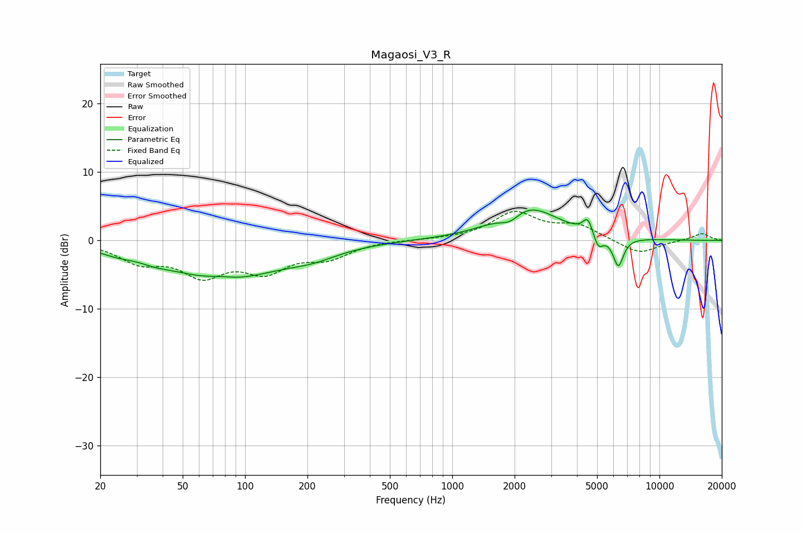

# Magaosi_V3_R
See [usage instructions](https://github.com/jaakkopasanen/AutoEq#usage) for more options and info.

### Parametric EQs
Apply preamp of -4.5 dB when using parametric equalizer.

|   # | Type    |   Fc (Hz) |    Q |   Gain (dB) |
|-----|---------|-----------|------|-------------|
|   1 | Peaking |        24 | 1.67 |        -0.7 |
|   2 | Peaking |        37 | 2.07 |        -0.5 |
|   3 | Peaking |        76 | 2.11 |         0.5 |
|   4 | Peaking |        78 | 0.52 |        -5.6 |
|   5 | Peaking |       213 | 1.15 |        -1.2 |
|   6 | Peaking |      1903 | 2.85 |        -1.6 |
|   7 | Peaking |      2291 | 0.96 |         5.1 |
|   8 | Peaking |      4513 | 6    |         2.3 |
|   9 | Peaking |      5070 | 5.99 |        -2.1 |
|  10 | Peaking |      6333 | 5.45 |        -4.3 |

### Fixed Band EQs
When using fixed band (also called graphic) equalizer, apply preamp of **-4.3 dB** (if available) and set gains manually with these parameters.

|   # | Type    |   Fc (Hz) |    Q |   Gain (dB) |
|-----|---------|-----------|------|-------------|
|   1 | Peaking |        31 | 1.41 |        -2.8 |
|   2 | Peaking |        62 | 1.41 |        -4.5 |
|   3 | Peaking |       125 | 1.41 |        -3.9 |
|   4 | Peaking |       250 | 1.41 |        -2.2 |
|   5 | Peaking |       500 | 1.41 |         0.1 |
|   6 | Peaking |      1000 | 1.41 |         0.1 |
|   7 | Peaking |      2000 | 1.41 |         3.9 |
|   8 | Peaking |      4000 | 1.41 |         2   |
|   9 | Peaking |      8000 | 1.41 |        -2   |
|  10 | Peaking |     16000 | 1.41 |         1.1 |

### Graphs

