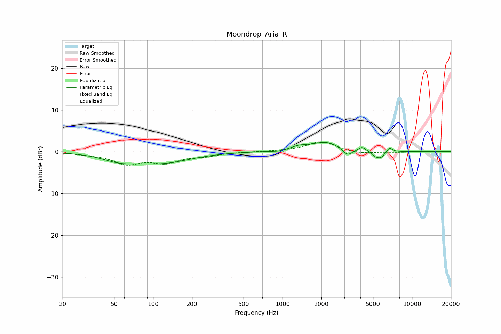

# Moondrop_Aria_R
See [usage instructions](https://github.com/jaakkopasanen/AutoEq#usage) for more options and info.

### Parametric EQs
Apply preamp of -2.3 dB when using parametric equalizer.

|   # | Type    |   Fc (Hz) |    Q |   Gain (dB) |
|-----|---------|-----------|------|-------------|
|   1 | Peaking |        55 | 1.09 |        -1.7 |
|   2 | Peaking |       119 | 0.68 |        -2.5 |
|   3 | Peaking |       932 | 2.8  |        -0.3 |
|   4 | Peaking |      1336 | 2.16 |         0.9 |
|   5 | Peaking |      2158 | 1.31 |         2.3 |
|   6 | Peaking |      3176 | 3.86 |        -1.7 |
|   7 | Peaking |      4119 | 5.45 |         1   |
|   8 | Peaking |      5202 | 6    |        -0.8 |
|   9 | Peaking |      5745 | 4.26 |        -1.5 |
|  10 | Peaking |      6702 | 6    |         1.2 |

### Fixed Band EQs
When using fixed band (also called graphic) equalizer, apply preamp of **-2.5 dB** (if available) and set gains manually with these parameters.

|   # | Type    |   Fc (Hz) |    Q |   Gain (dB) |
|-----|---------|-----------|------|-------------|
|   1 | Peaking |        31 | 1.41 |        -0.4 |
|   2 | Peaking |        62 | 1.41 |        -2.7 |
|   3 | Peaking |       125 | 1.41 |        -2.3 |
|   4 | Peaking |       250 | 1.41 |        -0.8 |
|   5 | Peaking |       500 | 1.41 |        -0   |
|   6 | Peaking |      1000 | 1.41 |         0.1 |
|   7 | Peaking |      2000 | 1.41 |         2.5 |
|   8 | Peaking |      4000 | 1.41 |        -0.6 |
|   9 | Peaking |      8000 | 1.41 |        -0.1 |
|  10 | Peaking |     16000 | 1.41 |         0.1 |

### Graphs

