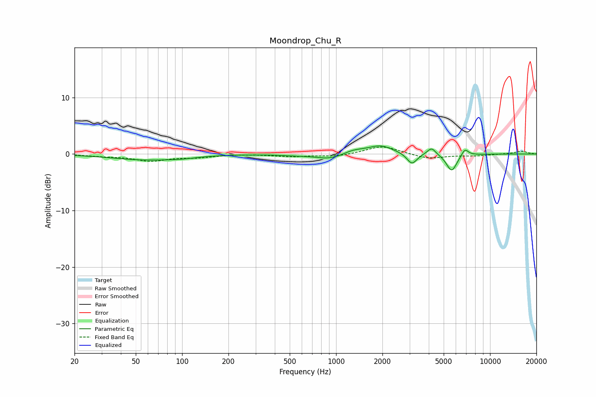

# Moondrop_Chu_R
See [usage instructions](https://github.com/jaakkopasanen/AutoEq#usage) for more options and info.

### Parametric EQs
Apply preamp of -1.5 dB when using parametric equalizer.

|   # | Type    |   Fc (Hz) |    Q |   Gain (dB) |
|-----|---------|-----------|------|-------------|
|   1 | Peaking |        56 | 0.66 |        -1   |
|   2 | Peaking |        99 | 1.36 |        -0.3 |
|   3 | Peaking |       558 | 1.34 |        -0.2 |
|   4 | Peaking |       914 | 1.6  |        -0.9 |
|   5 | Peaking |      1300 | 2.13 |         0.6 |
|   6 | Peaking |      1942 | 1.73 |         1.5 |
|   7 | Peaking |      3109 | 4.31 |        -2   |
|   8 | Peaking |      4169 | 5.01 |         1.3 |
|   9 | Peaking |      5634 | 4.08 |        -3.1 |
|  10 | Peaking |      6866 | 6    |         1.3 |

### Fixed Band EQs
When using fixed band (also called graphic) equalizer, apply preamp of **-1.3 dB** (if available) and set gains manually with these parameters.

|   # | Type    |   Fc (Hz) |    Q |   Gain (dB) |
|-----|---------|-----------|------|-------------|
|   1 | Peaking |        31 | 1.41 |        -0.3 |
|   2 | Peaking |        62 | 1.41 |        -1.2 |
|   3 | Peaking |       125 | 1.41 |        -0.5 |
|   4 | Peaking |       250 | 1.41 |         0   |
|   5 | Peaking |       500 | 1.41 |        -0.4 |
|   6 | Peaking |      1000 | 1.41 |        -0.4 |
|   7 | Peaking |      2000 | 1.41 |         1.5 |
|   8 | Peaking |      4000 | 1.41 |        -0.9 |
|   9 | Peaking |      8000 | 1.41 |        -0.3 |
|  10 | Peaking |     16000 | 1.41 |         0.5 |

### Graphs

