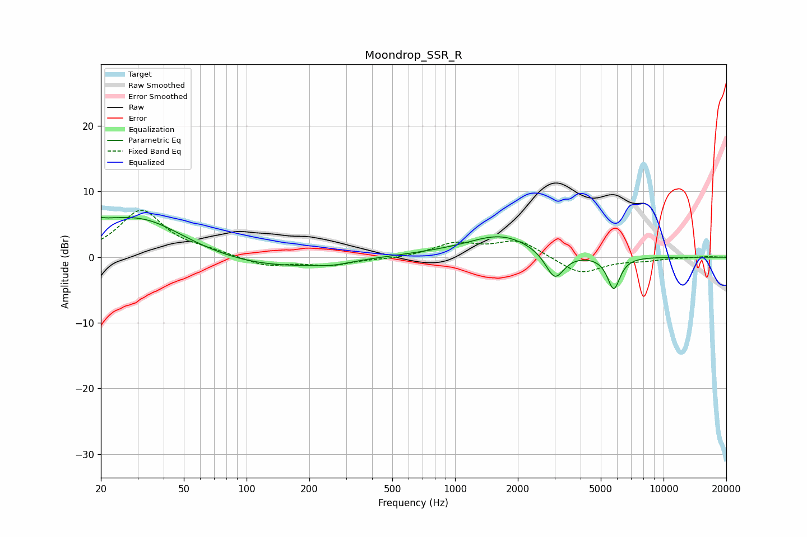

# Moondrop_SSR_R
See [usage instructions](https://github.com/jaakkopasanen/AutoEq#usage) for more options and info.

### Parametric EQs
Apply preamp of -6.1 dB when using parametric equalizer.

|   # | Type    |   Fc (Hz) |    Q |   Gain (dB) |
|-----|---------|-----------|------|-------------|
|   1 | Peaking |        20 | 1.53 |         1.6 |
|   2 | Peaking |        20 | 5.74 |         3.2 |
|   3 | Peaking |        21 | 5.88 |        -2.6 |
|   4 | Peaking |        32 | 0.7  |         5.6 |
|   5 | Peaking |       127 | 0.5  |        -1.7 |
|   6 | Peaking |       258 | 1.6  |        -0.5 |
|   7 | Peaking |       789 | 0.61 |         0.4 |
|   8 | Peaking |      1671 | 0.89 |         3.2 |
|   9 | Peaking |      3008 | 3.17 |        -4.3 |
|  10 | Peaking |      5769 | 4.61 |        -5   |

### Fixed Band EQs
When using fixed band (also called graphic) equalizer, apply preamp of **-7.3 dB** (if available) and set gains manually with these parameters.

|   # | Type    |   Fc (Hz) |    Q |   Gain (dB) |
|-----|---------|-----------|------|-------------|
|   1 | Peaking |        31 | 1.41 |         7.1 |
|   2 | Peaking |        62 | 1.41 |         0.7 |
|   3 | Peaking |       125 | 1.41 |        -1.4 |
|   4 | Peaking |       250 | 1.41 |        -1.2 |
|   5 | Peaking |       500 | 1.41 |        -0.3 |
|   6 | Peaking |      1000 | 1.41 |         2   |
|   7 | Peaking |      2000 | 1.41 |         2.5 |
|   8 | Peaking |      4000 | 1.41 |        -2.6 |
|   9 | Peaking |      8000 | 1.41 |        -0.4 |
|  10 | Peaking |     16000 | 1.41 |         0.1 |

### Graphs

