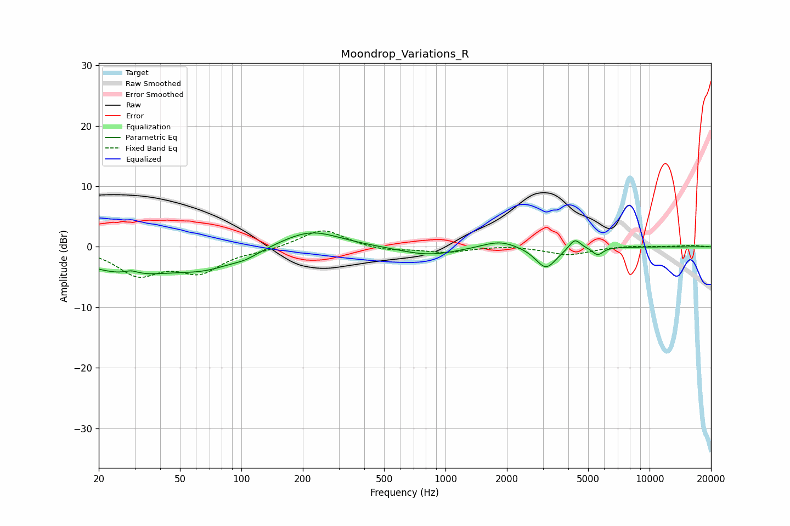

# Moondrop_Variations_R
See [usage instructions](https://github.com/jaakkopasanen/AutoEq#usage) for more options and info.

### Parametric EQs
Apply preamp of -2.4 dB when using parametric equalizer.

|   # | Type    |   Fc (Hz) |    Q |   Gain (dB) |
|-----|---------|-----------|------|-------------|
|   1 | Peaking |        28 | 0.61 |        -4.2 |
|   2 | Peaking |        29 | 4.03 |         0.7 |
|   3 | Peaking |        67 | 0.96 |        -2.3 |
|   4 | Peaking |       105 | 2.01 |        -0.9 |
|   5 | Peaking |       218 | 0.98 |         2.9 |
|   6 | Peaking |       825 | 1    |        -1.5 |
|   7 | Peaking |      1848 | 1.63 |         1.3 |
|   8 | Peaking |      3107 | 2.77 |        -3.6 |
|   9 | Peaking |      4303 | 4.96 |         1.8 |
|  10 | Peaking |      5568 | 5.47 |        -1.3 |

### Fixed Band EQs
When using fixed band (also called graphic) equalizer, apply preamp of **-2.7 dB** (if available) and set gains manually with these parameters.

|   # | Type    |   Fc (Hz) |    Q |   Gain (dB) |
|-----|---------|-----------|------|-------------|
|   1 | Peaking |        31 | 1.41 |        -4.3 |
|   2 | Peaking |        62 | 1.41 |        -3.8 |
|   3 | Peaking |       125 | 1.41 |        -0.5 |
|   4 | Peaking |       250 | 1.41 |         3   |
|   5 | Peaking |       500 | 1.41 |        -0.7 |
|   6 | Peaking |      1000 | 1.41 |        -0.9 |
|   7 | Peaking |      2000 | 1.41 |         0.3 |
|   8 | Peaking |      4000 | 1.41 |        -1.3 |
|   9 | Peaking |      8000 | 1.41 |         0.2 |
|  10 | Peaking |     16000 | 1.41 |         0.3 |

### Graphs

