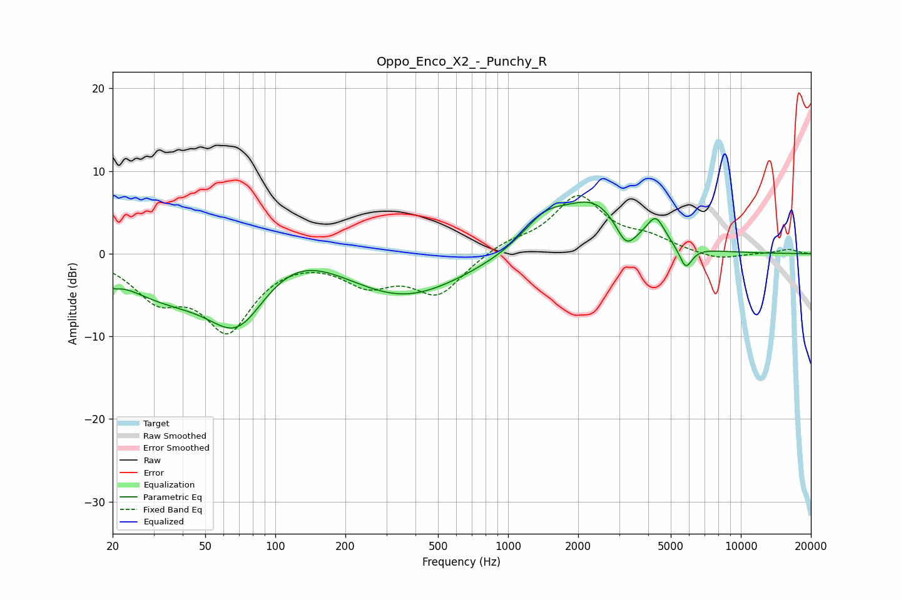

# Oppo_Enco_X2_-_Punchy_R
See [usage instructions](https://github.com/jaakkopasanen/AutoEq#usage) for more options and info.

### Parametric EQs
Apply preamp of -6.3 dB when using parametric equalizer.

|   # | Type    |   Fc (Hz) |    Q |   Gain (dB) |
|-----|---------|-----------|------|-------------|
|   1 | Peaking |        20 | 5    |        -0.9 |
|   2 | Peaking |        32 | 0.72 |        -3.9 |
|   3 | Peaking |        69 | 1.01 |        -8.7 |
|   4 | Peaking |       116 | 0.72 |         3.6 |
|   5 | Peaking |       354 | 0.54 |        -5.4 |
|   6 | Peaking |      1439 | 1.39 |         3.5 |
|   7 | Peaking |      2347 | 1.04 |         5.7 |
|   8 | Peaking |      3215 | 3.32 |        -2.9 |
|   9 | Peaking |      4314 | 3.69 |         3   |
|  10 | Peaking |      5794 | 4.92 |        -2.7 |

### Fixed Band EQs
When using fixed band (also called graphic) equalizer, apply preamp of **-7.1 dB** (if available) and set gains manually with these parameters.

|   # | Type    |   Fc (Hz) |    Q |   Gain (dB) |
|-----|---------|-----------|------|-------------|
|   1 | Peaking |        31 | 1.41 |        -4.7 |
|   2 | Peaking |        62 | 1.41 |        -8.7 |
|   3 | Peaking |       125 | 1.41 |         0.1 |
|   4 | Peaking |       250 | 1.41 |        -3.3 |
|   5 | Peaking |       500 | 1.41 |        -4.7 |
|   6 | Peaking |      1000 | 1.41 |         1.2 |
|   7 | Peaking |      2000 | 1.41 |         6.8 |
|   8 | Peaking |      4000 | 1.41 |         1.5 |
|   9 | Peaking |      8000 | 1.41 |        -0.8 |
|  10 | Peaking |     16000 | 1.41 |         0.5 |

### Graphs

