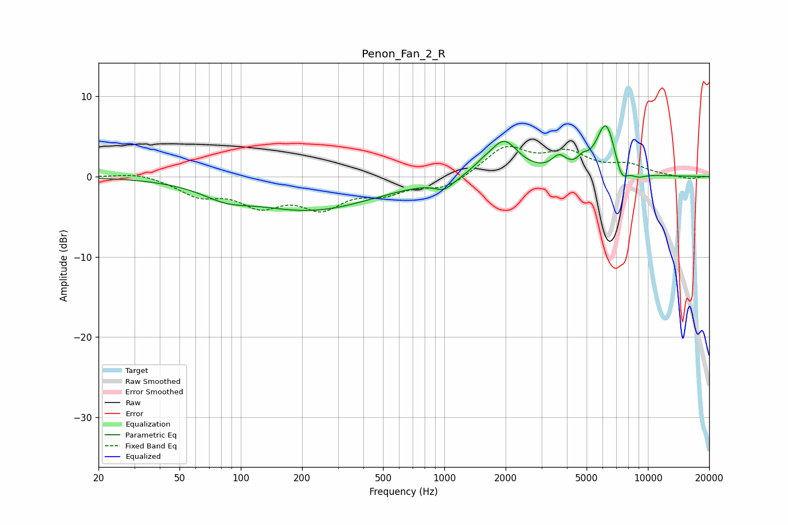

# Penon_Fan_2_R
See [usage instructions](https://github.com/jaakkopasanen/AutoEq#usage) for more options and info.

### Parametric EQs
Apply preamp of -6.4 dB when using parametric equalizer.

|   # | Type    |   Fc (Hz) |    Q |   Gain (dB) |
|-----|---------|-----------|------|-------------|
|   1 | Peaking |        84 | 1.26 |        -1.3 |
|   2 | Peaking |       221 | 0.45 |        -4.1 |
|   3 | Peaking |       997 | 3.08 |        -1.2 |
|   4 | Peaking |      1518 | 3.24 |         0.6 |
|   5 | Peaking |      1958 | 1.98 |         4.4 |
|   6 | Peaking |      3659 | 3.98 |         1.7 |
|   7 | Peaking |      4782 | 6    |         0.9 |
|   8 | Peaking |      6223 | 2.84 |         6.7 |
|   9 | Peaking |      7409 | 4.37 |        -2.3 |
|  10 | Peaking |      8948 | 3.13 |        -0.6 |

### Fixed Band EQs
When using fixed band (also called graphic) equalizer, apply preamp of **-3.8 dB** (if available) and set gains manually with these parameters.

|   # | Type    |   Fc (Hz) |    Q |   Gain (dB) |
|-----|---------|-----------|------|-------------|
|   1 | Peaking |        31 | 1.41 |         0.6 |
|   2 | Peaking |        62 | 1.41 |        -2.1 |
|   3 | Peaking |       125 | 1.41 |        -3.1 |
|   4 | Peaking |       250 | 1.41 |        -3.4 |
|   5 | Peaking |       500 | 1.41 |        -1.7 |
|   6 | Peaking |      1000 | 1.41 |        -1.5 |
|   7 | Peaking |      2000 | 1.41 |         3.6 |
|   8 | Peaking |      4000 | 1.41 |         2.7 |
|   9 | Peaking |      8000 | 1.41 |         1.3 |
|  10 | Peaking |     16000 | 1.41 |        -0.3 |

### Graphs

