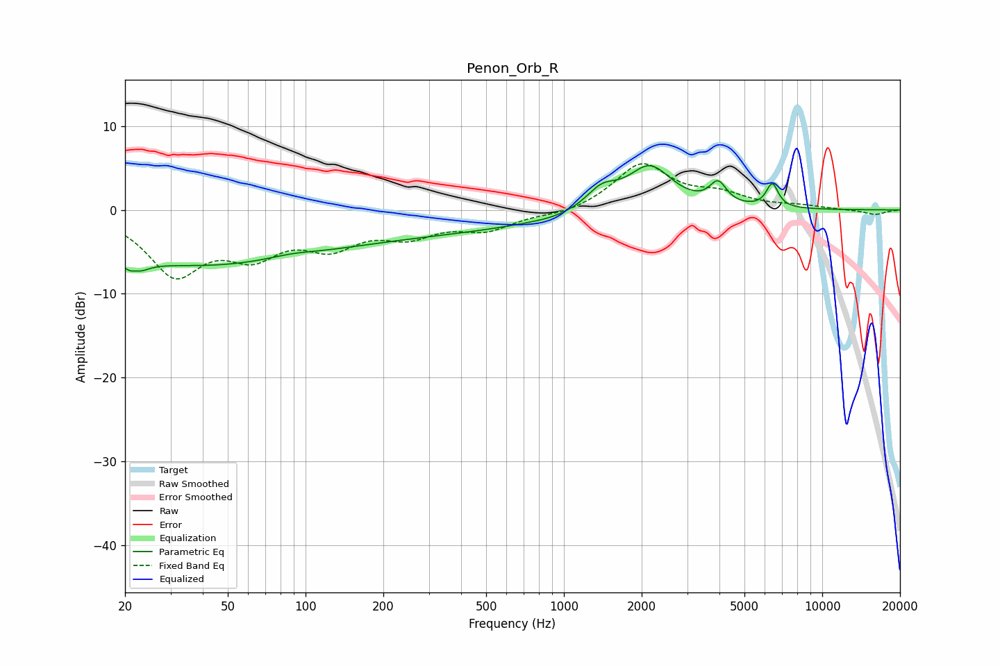

# Penon_Orb_R
See [usage instructions](https://github.com/jaakkopasanen/AutoEq#usage) for more options and info.

### Parametric EQs
Apply preamp of -5.4 dB when using parametric equalizer.

|   # | Type    |   Fc (Hz) |    Q |   Gain (dB) |
|-----|---------|-----------|------|-------------|
|   1 | Peaking |        22 | 4.39 |        -5.1 |
|   2 | Peaking |        22 | 5.36 |         3.6 |
|   3 | Peaking |        32 | 0.31 |        -5.9 |
|   4 | Peaking |        88 | 1.5  |         0.5 |
|   5 | Peaking |       241 | 0.26 |        -2.6 |
|   6 | Peaking |       906 | 1.91 |        -0.2 |
|   7 | Peaking |      1401 | 2.32 |         2.3 |
|   8 | Peaking |      2150 | 1.63 |         5.2 |
|   9 | Peaking |      3952 | 4.39 |         2.6 |
|  10 | Peaking |      6405 | 6    |         2.8 |

### Fixed Band EQs
When using fixed band (also called graphic) equalizer, apply preamp of **-5.6 dB** (if available) and set gains manually with these parameters.

|   # | Type    |   Fc (Hz) |    Q |   Gain (dB) |
|-----|---------|-----------|------|-------------|
|   1 | Peaking |        31 | 1.41 |        -7.2 |
|   2 | Peaking |        62 | 1.41 |        -4.4 |
|   3 | Peaking |       125 | 1.41 |        -3.7 |
|   4 | Peaking |       250 | 1.41 |        -2.6 |
|   5 | Peaking |       500 | 1.41 |        -2.1 |
|   6 | Peaking |      1000 | 1.41 |        -0.6 |
|   7 | Peaking |      2000 | 1.41 |         5.4 |
|   8 | Peaking |      4000 | 1.41 |         1.6 |
|   9 | Peaking |      8000 | 1.41 |         0.4 |
|  10 | Peaking |     16000 | 1.41 |        -0.6 |

### Graphs

