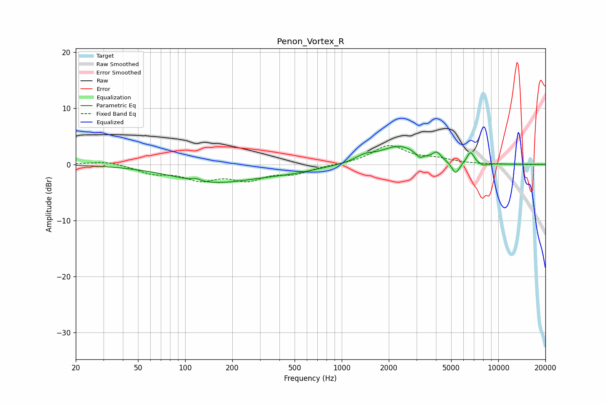

# Penon_Vortex_R
See [usage instructions](https://github.com/jaakkopasanen/AutoEq#usage) for more options and info.

### Parametric EQs
Apply preamp of -3.3 dB when using parametric equalizer.

|   # | Type    |   Fc (Hz) |    Q |   Gain (dB) |
|-----|---------|-----------|------|-------------|
|   1 | Peaking |       118 | 5.65 |         0.4 |
|   2 | Peaking |       153 | 0.53 |        -3.1 |
|   3 | Peaking |       472 | 0.73 |        -0.9 |
|   4 | Peaking |      1397 | 2.45 |         1   |
|   5 | Peaking |      2332 | 1.14 |         3.2 |
|   6 | Peaking |      3149 | 5.73 |        -0.9 |
|   7 | Peaking |      4050 | 5.45 |         1.3 |
|   8 | Peaking |      5340 | 5.61 |        -2.2 |
|   9 | Peaking |      6652 | 6    |         2.1 |
|  10 | Peaking |      8002 | 4.75 |        -0.5 |

### Fixed Band EQs
When using fixed band (also called graphic) equalizer, apply preamp of **-3.5 dB** (if available) and set gains manually with these parameters.

|   # | Type    |   Fc (Hz) |    Q |   Gain (dB) |
|-----|---------|-----------|------|-------------|
|   1 | Peaking |        31 | 1.41 |         0.6 |
|   2 | Peaking |        62 | 1.41 |        -1.4 |
|   3 | Peaking |       125 | 1.41 |        -2.4 |
|   4 | Peaking |       250 | 1.41 |        -2.4 |
|   5 | Peaking |       500 | 1.41 |        -1.4 |
|   6 | Peaking |      1000 | 1.41 |        -0   |
|   7 | Peaking |      2000 | 1.41 |         3.3 |
|   8 | Peaking |      4000 | 1.41 |         0.8 |
|   9 | Peaking |      8000 | 1.41 |        -0   |
|  10 | Peaking |     16000 | 1.41 |        -0.1 |

### Graphs

