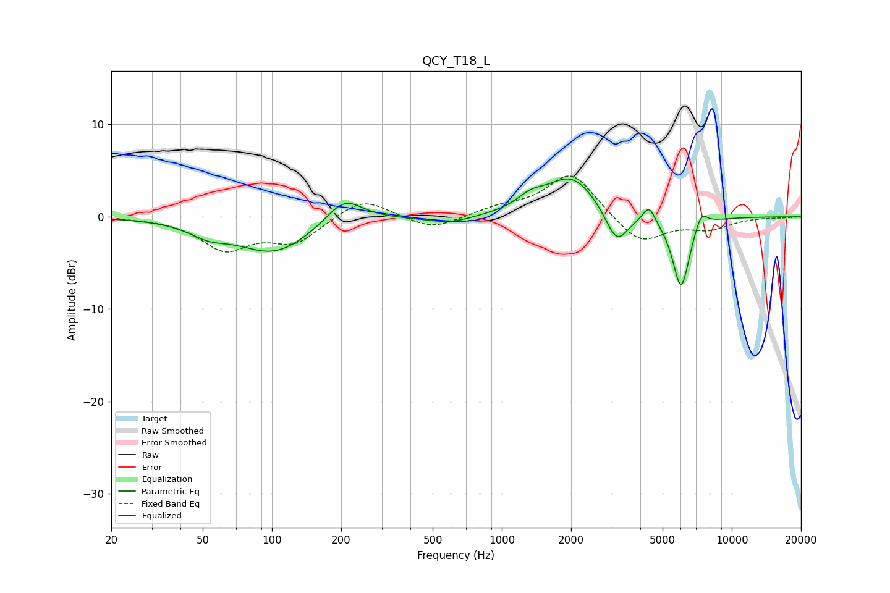

# QCY_T18_L
See [usage instructions](https://github.com/jaakkopasanen/AutoEq#usage) for more options and info.

### Parametric EQs
Apply preamp of -4.2 dB when using parametric equalizer.

|   # | Type    |   Fc (Hz) |    Q |   Gain (dB) |
|-----|---------|-----------|------|-------------|
|   1 | Peaking |        53 | 1.7  |        -1.2 |
|   2 | Peaking |       102 | 0.87 |        -3.9 |
|   3 | Peaking |       206 | 1.76 |         2.8 |
|   4 | Peaking |       597 | 1.45 |        -0.8 |
|   5 | Peaking |      1331 | 2.45 |         1.2 |
|   6 | Peaking |      2009 | 1.26 |         4.4 |
|   7 | Peaking |      3157 | 2.79 |        -3.8 |
|   8 | Peaking |      4366 | 5.23 |         1.9 |
|   9 | Peaking |      6021 | 3.65 |        -7.9 |
|  10 | Peaking |      7348 | 4.77 |         1.8 |

### Fixed Band EQs
When using fixed band (also called graphic) equalizer, apply preamp of **-4.5 dB** (if available) and set gains manually with these parameters.

|   # | Type    |   Fc (Hz) |    Q |   Gain (dB) |
|-----|---------|-----------|------|-------------|
|   1 | Peaking |        31 | 1.41 |        -0   |
|   2 | Peaking |        62 | 1.41 |        -3.4 |
|   3 | Peaking |       125 | 1.41 |        -2.7 |
|   4 | Peaking |       250 | 1.41 |         2.2 |
|   5 | Peaking |       500 | 1.41 |        -1.4 |
|   6 | Peaking |      1000 | 1.41 |         0.9 |
|   7 | Peaking |      2000 | 1.41 |         4.8 |
|   8 | Peaking |      4000 | 1.41 |        -3   |
|   9 | Peaking |      8000 | 1.41 |        -1.2 |
|  10 | Peaking |     16000 | 1.41 |        -0.1 |

### Graphs

