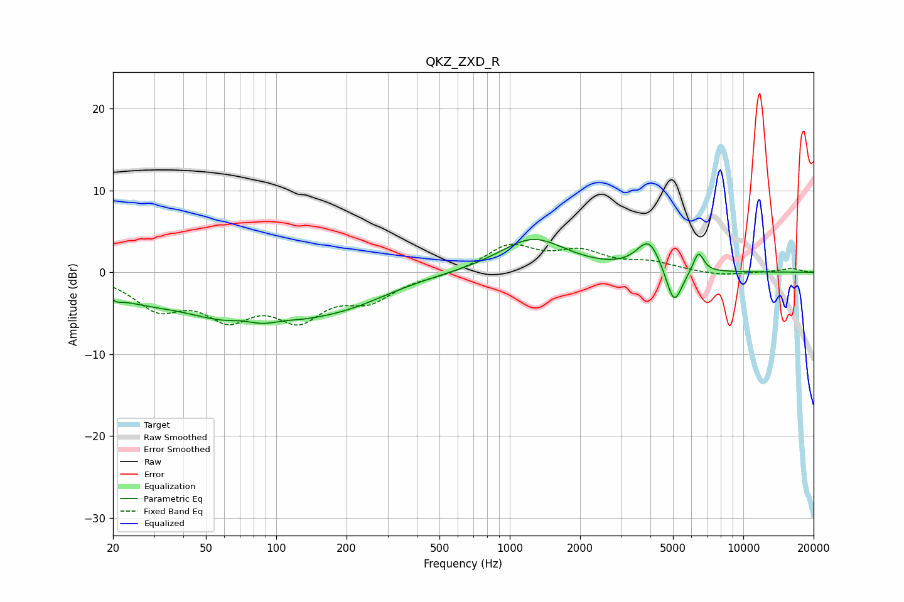

# QKZ_ZXD_R
See [usage instructions](https://github.com/jaakkopasanen/AutoEq#usage) for more options and info.

### Parametric EQs
Apply preamp of -4.1 dB when using parametric equalizer.

|   # | Type    |   Fc (Hz) |    Q |   Gain (dB) |
|-----|---------|-----------|------|-------------|
|   1 | Peaking |        21 | 5.91 |        -0.5 |
|   2 | Peaking |        24 | 0.85 |        -1.7 |
|   3 | Peaking |        71 | 2.38 |         0.6 |
|   4 | Peaking |        82 | 0.48 |        -6.3 |
|   5 | Peaking |       108 | 2.1  |         0.5 |
|   6 | Peaking |       214 | 0.79 |        -1.6 |
|   7 | Peaking |      1254 | 0.99 |         4.1 |
|   8 | Peaking |      3944 | 2.7  |         3.8 |
|   9 | Peaking |      5054 | 3.99 |        -4.8 |
|  10 | Peaking |      6426 | 6    |         2.5 |

### Fixed Band EQs
When using fixed band (also called graphic) equalizer, apply preamp of **-3.5 dB** (if available) and set gains manually with these parameters.

|   # | Type    |   Fc (Hz) |    Q |   Gain (dB) |
|-----|---------|-----------|------|-------------|
|   1 | Peaking |        31 | 1.41 |        -3.9 |
|   2 | Peaking |        62 | 1.41 |        -4.7 |
|   3 | Peaking |       125 | 1.41 |        -4.9 |
|   4 | Peaking |       250 | 1.41 |        -2.9 |
|   5 | Peaking |       500 | 1.41 |        -0.4 |
|   6 | Peaking |      1000 | 1.41 |         3.2 |
|   7 | Peaking |      2000 | 1.41 |         2.2 |
|   8 | Peaking |      4000 | 1.41 |         1   |
|   9 | Peaking |      8000 | 1.41 |        -0.4 |
|  10 | Peaking |     16000 | 1.41 |         0.5 |

### Graphs

