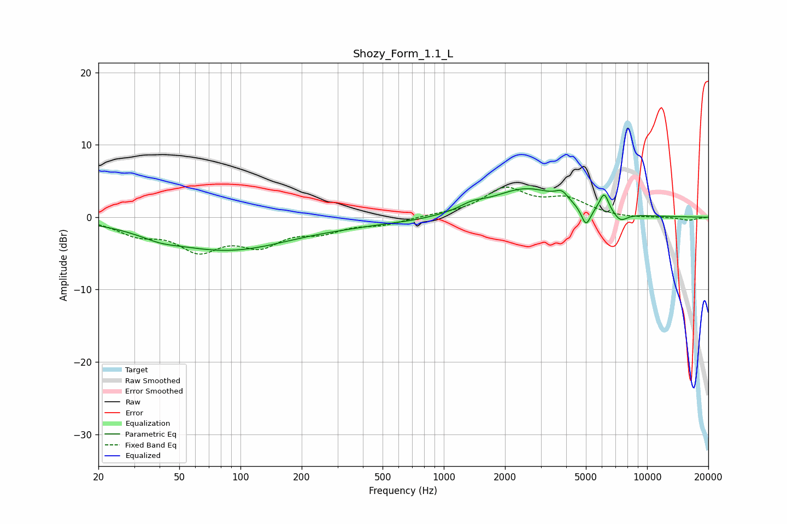

# Shozy_Form_1.1_L
See [usage instructions](https://github.com/jaakkopasanen/AutoEq#usage) for more options and info.

### Parametric EQs
Apply preamp of -4.0 dB when using parametric equalizer.

|   # | Type    |   Fc (Hz) |    Q |   Gain (dB) |
|-----|---------|-----------|------|-------------|
|   1 | Peaking |        40 | 1.66 |        -0.6 |
|   2 | Peaking |        86 | 0.44 |        -4.5 |
|   3 | Peaking |       336 | 0.9  |        -0.4 |
|   4 | Peaking |       672 | 0.84 |        -0.4 |
|   5 | Peaking |      1374 | 2.37 |         0.8 |
|   6 | Peaking |      2547 | 0.83 |         3.9 |
|   7 | Peaking |      3806 | 4.55 |         1.2 |
|   8 | Peaking |      5006 | 5.97 |        -2.7 |
|   9 | Peaking |      6148 | 5.98 |         2.7 |
|  10 | Peaking |      7393 | 4.03 |        -1.2 |

### Fixed Band EQs
When using fixed band (also called graphic) equalizer, apply preamp of **-4.2 dB** (if available) and set gains manually with these parameters.

|   # | Type    |   Fc (Hz) |    Q |   Gain (dB) |
|-----|---------|-----------|------|-------------|
|   1 | Peaking |        31 | 1.41 |        -2   |
|   2 | Peaking |        62 | 1.41 |        -4.1 |
|   3 | Peaking |       125 | 1.41 |        -3.3 |
|   4 | Peaking |       250 | 1.41 |        -1.7 |
|   5 | Peaking |       500 | 1.41 |        -0.9 |
|   6 | Peaking |      1000 | 1.41 |         0.3 |
|   7 | Peaking |      2000 | 1.41 |         3.8 |
|   8 | Peaking |      4000 | 1.41 |         2.3 |
|   9 | Peaking |      8000 | 1.41 |        -0.2 |
|  10 | Peaking |     16000 | 1.41 |        -0.4 |

### Graphs

