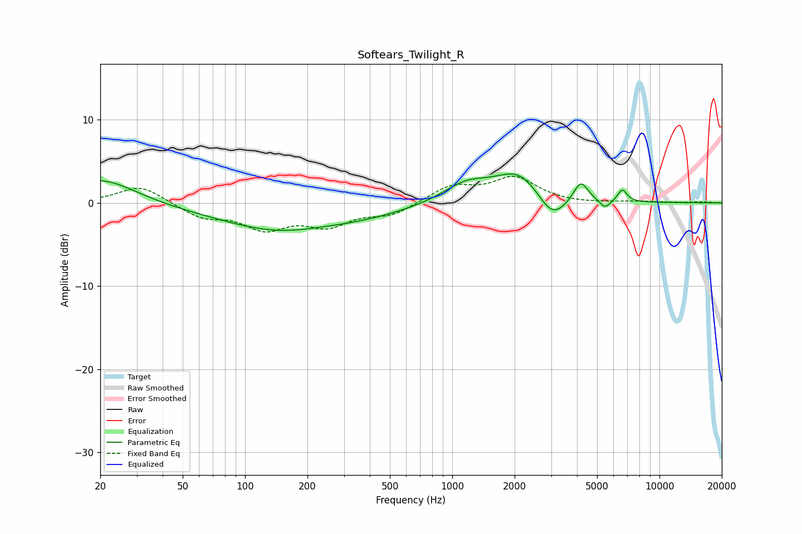

# Softears_Twilight_R
See [usage instructions](https://github.com/jaakkopasanen/AutoEq#usage) for more options and info.

### Parametric EQs
Apply preamp of -3.6 dB when using parametric equalizer.

|   # | Type    |   Fc (Hz) |    Q |   Gain (dB) |
|-----|---------|-----------|------|-------------|
|   1 | Peaking |        20 | 0.83 |         3.2 |
|   2 | Peaking |        34 | 0.43 |        -0.4 |
|   3 | Peaking |       192 | 0.45 |        -4.9 |
|   4 | Peaking |       224 | 0.69 |         1.7 |
|   5 | Peaking |      1169 | 1.22 |         2.3 |
|   6 | Peaking |      2103 | 1.25 |         3.6 |
|   7 | Peaking |      3032 | 2.01 |        -3.2 |
|   8 | Peaking |      4172 | 3.95 |         2.6 |
|   9 | Peaking |      5460 | 5.4  |        -1   |
|  10 | Peaking |      6619 | 6    |         1.5 |

### Fixed Band EQs
When using fixed band (also called graphic) equalizer, apply preamp of **-3.3 dB** (if available) and set gains manually with these parameters.

|   # | Type    |   Fc (Hz) |    Q |   Gain (dB) |
|-----|---------|-----------|------|-------------|
|   1 | Peaking |        31 | 1.41 |         2.1 |
|   2 | Peaking |        62 | 1.41 |        -1.6 |
|   3 | Peaking |       125 | 1.41 |        -2.8 |
|   4 | Peaking |       250 | 1.41 |        -2.4 |
|   5 | Peaking |       500 | 1.41 |        -1.4 |
|   6 | Peaking |      1000 | 1.41 |         2   |
|   7 | Peaking |      2000 | 1.41 |         2.9 |
|   8 | Peaking |      4000 | 1.41 |        -0.1 |
|   9 | Peaking |      8000 | 1.41 |         0.1 |
|  10 | Peaking |     16000 | 1.41 |         0.1 |

### Graphs

