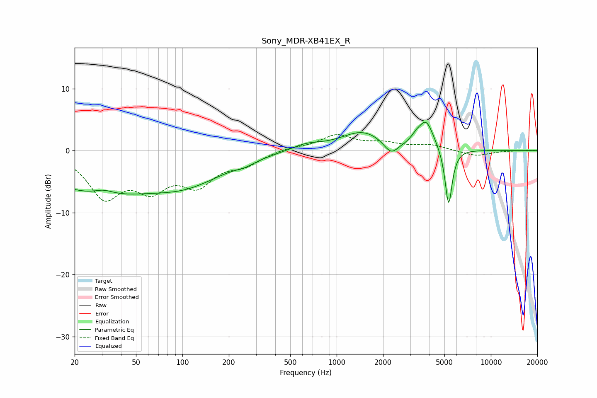

# Sony_MDR-XB41EX_R
See [usage instructions](https://github.com/jaakkopasanen/AutoEq#usage) for more options and info.

### Parametric EQs
Apply preamp of -4.7 dB when using parametric equalizer.

|   # | Type    |   Fc (Hz) |    Q |   Gain (dB) |
|-----|---------|-----------|------|-------------|
|   1 | Peaking |        27 | 0.4  |        -6.5 |
|   2 | Peaking |        31 | 2.07 |         1   |
|   3 | Peaking |       108 | 0.57 |        -4.2 |
|   4 | Peaking |       256 | 2.29 |        -0.6 |
|   5 | Peaking |       633 | 1.44 |         1   |
|   6 | Peaking |      1478 | 1    |         3   |
|   7 | Peaking |      2253 | 2.97 |        -2.2 |
|   8 | Peaking |      3265 | 4.76 |         0.8 |
|   9 | Peaking |      3802 | 2.85 |         4.5 |
|  10 | Peaking |      5321 | 5.97 |        -9.5 |

### Fixed Band EQs
When using fixed band (also called graphic) equalizer, apply preamp of **-2.7 dB** (if available) and set gains manually with these parameters.

|   # | Type    |   Fc (Hz) |    Q |   Gain (dB) |
|-----|---------|-----------|------|-------------|
|   1 | Peaking |        31 | 1.41 |        -7   |
|   2 | Peaking |        62 | 1.41 |        -5.1 |
|   3 | Peaking |       125 | 1.41 |        -4.8 |
|   4 | Peaking |       250 | 1.41 |        -1.9 |
|   5 | Peaking |       500 | 1.41 |         0.5 |
|   6 | Peaking |      1000 | 1.41 |         2.4 |
|   7 | Peaking |      2000 | 1.41 |         1   |
|   8 | Peaking |      4000 | 1.41 |         0.9 |
|   9 | Peaking |      8000 | 1.41 |        -0.9 |
|  10 | Peaking |     16000 | 1.41 |         0   |

### Graphs

