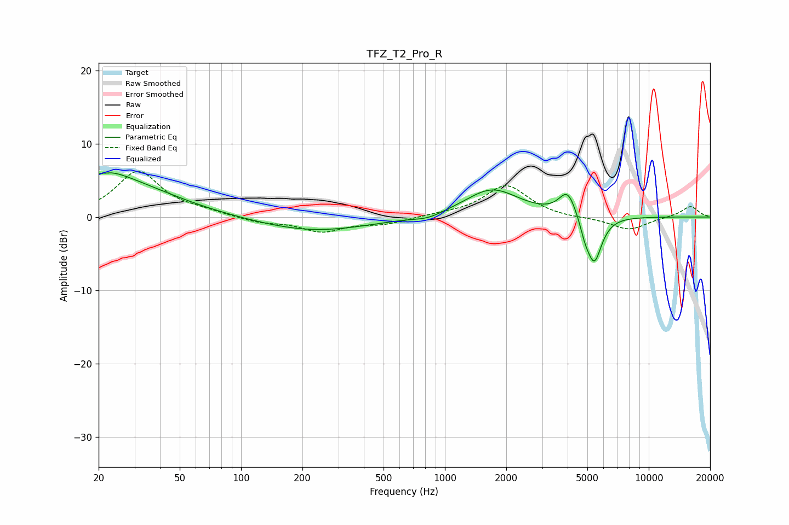

# TFZ_T2_Pro_R
See [usage instructions](https://github.com/jaakkopasanen/AutoEq#usage) for more options and info.

### Parametric EQs
Apply preamp of -6.1 dB when using parametric equalizer.

|   # | Type    |   Fc (Hz) |    Q |   Gain (dB) |
|-----|---------|-----------|------|-------------|
|   1 | Peaking |        21 | 5.91 |         3.2 |
|   2 | Peaking |        21 | 5.79 |        -3.4 |
|   3 | Peaking |        21 | 1.36 |         1.8 |
|   4 | Peaking |        24 | 0.51 |         4.5 |
|   5 | Peaking |       226 | 0.52 |        -2   |
|   6 | Peaking |       826 | 2    |        -0.6 |
|   7 | Peaking |      1701 | 1.06 |         3.8 |
|   8 | Peaking |      4004 | 3.3  |         3.5 |
|   9 | Peaking |      4859 | 5.99 |        -1.5 |
|  10 | Peaking |      5397 | 3.67 |        -6.5 |

### Fixed Band EQs
When using fixed band (also called graphic) equalizer, apply preamp of **-6.3 dB** (if available) and set gains manually with these parameters.

|   # | Type    |   Fc (Hz) |    Q |   Gain (dB) |
|-----|---------|-----------|------|-------------|
|   1 | Peaking |        31 | 1.41 |         6.2 |
|   2 | Peaking |        62 | 1.41 |         0.6 |
|   3 | Peaking |       125 | 1.41 |        -0.7 |
|   4 | Peaking |       250 | 1.41 |        -1.9 |
|   5 | Peaking |       500 | 1.41 |        -0.9 |
|   6 | Peaking |      1000 | 1.41 |         0.3 |
|   7 | Peaking |      2000 | 1.41 |         4.3 |
|   8 | Peaking |      4000 | 1.41 |        -0.2 |
|   9 | Peaking |      8000 | 1.41 |        -1.8 |
|  10 | Peaking |     16000 | 1.41 |         1.5 |

### Graphs

