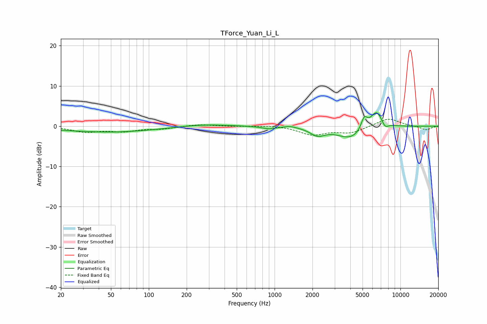

# TForce_Yuan_Li_L
See [usage instructions](https://github.com/jaakkopasanen/AutoEq#usage) for more options and info.

### Parametric EQs
Apply preamp of -3.4 dB when using parametric equalizer.

|   # | Type    |   Fc (Hz) |    Q |   Gain (dB) |
|-----|---------|-----------|------|-------------|
|   1 | Peaking |        47 | 0.32 |        -1.4 |
|   2 | Peaking |        54 | 1.11 |        -0.1 |
|   3 | Peaking |       267 | 0.76 |         0.6 |
|   4 | Peaking |       903 | 2.57 |        -0.6 |
|   5 | Peaking |      1326 | 3.02 |         0.4 |
|   6 | Peaking |      2193 | 2.47 |        -1.9 |
|   7 | Peaking |      4042 | 1.28 |        -3.1 |
|   8 | Peaking |      5150 | 5.65 |         3   |
|   9 | Peaking |      6457 | 2.68 |         4.5 |
|  10 | Peaking |      7534 | 5.01 |        -1.6 |

### Fixed Band EQs
When using fixed band (also called graphic) equalizer, apply preamp of **-1.8 dB** (if available) and set gains manually with these parameters.

|   # | Type    |   Fc (Hz) |    Q |   Gain (dB) |
|-----|---------|-----------|------|-------------|
|   1 | Peaking |        31 | 1.41 |        -1.3 |
|   2 | Peaking |        62 | 1.41 |        -1.1 |
|   3 | Peaking |       125 | 1.41 |        -0.6 |
|   4 | Peaking |       250 | 1.41 |         0.5 |
|   5 | Peaking |       500 | 1.41 |        -0   |
|   6 | Peaking |      1000 | 1.41 |         0.3 |
|   7 | Peaking |      2000 | 1.41 |        -2.1 |
|   8 | Peaking |      4000 | 1.41 |        -1.6 |
|   9 | Peaking |      8000 | 1.41 |         2   |
|  10 | Peaking |     16000 | 1.41 |        -1   |

### Graphs

