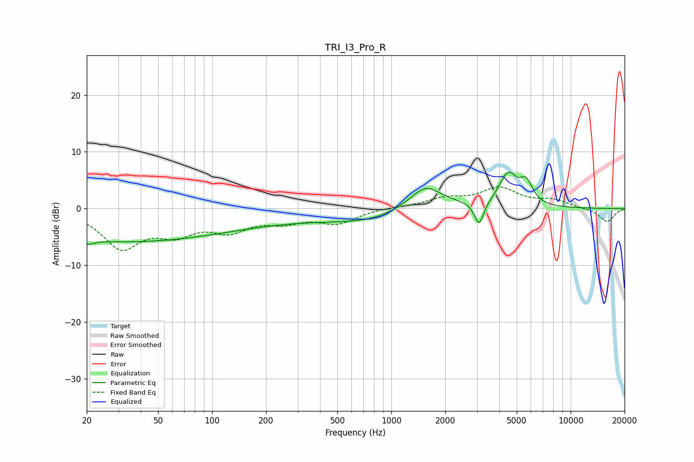

# TRI_I3_Pro_R
See [usage instructions](https://github.com/jaakkopasanen/AutoEq#usage) for more options and info.

### Parametric EQs
Apply preamp of -6.5 dB when using parametric equalizer.

|   # | Type    |   Fc (Hz) |    Q |   Gain (dB) |
|-----|---------|-----------|------|-------------|
|   1 | Peaking |        20 | 5.99 |         3.1 |
|   2 | Peaking |        20 | 5.46 |        -3.8 |
|   3 | Peaking |        32 | 0.23 |        -5.7 |
|   4 | Peaking |       237 | 0.46 |        -0.9 |
|   5 | Peaking |       829 | 0.53 |        -2.3 |
|   6 | Peaking |      1543 | 2.14 |         1.8 |
|   7 | Peaking |      1549 | 1.02 |         3.4 |
|   8 | Peaking |      3087 | 5.53 |        -4.2 |
|   9 | Peaking |      4475 | 2.78 |         5.7 |
|  10 | Peaking |      5653 | 3.85 |         3.6 |

### Fixed Band EQs
When using fixed band (also called graphic) equalizer, apply preamp of **-3.9 dB** (if available) and set gains manually with these parameters.

|   # | Type    |   Fc (Hz) |    Q |   Gain (dB) |
|-----|---------|-----------|------|-------------|
|   1 | Peaking |        31 | 1.41 |        -6.6 |
|   2 | Peaking |        62 | 1.41 |        -3.6 |
|   3 | Peaking |       125 | 1.41 |        -3.3 |
|   4 | Peaking |       250 | 1.41 |        -1.9 |
|   5 | Peaking |       500 | 1.41 |        -2.4 |
|   6 | Peaking |      1000 | 1.41 |         0.3 |
|   7 | Peaking |      2000 | 1.41 |         1.6 |
|   8 | Peaking |      4000 | 1.41 |         3.4 |
|   9 | Peaking |      8000 | 1.41 |         1.3 |
|  10 | Peaking |     16000 | 1.41 |        -2.4 |

### Graphs

