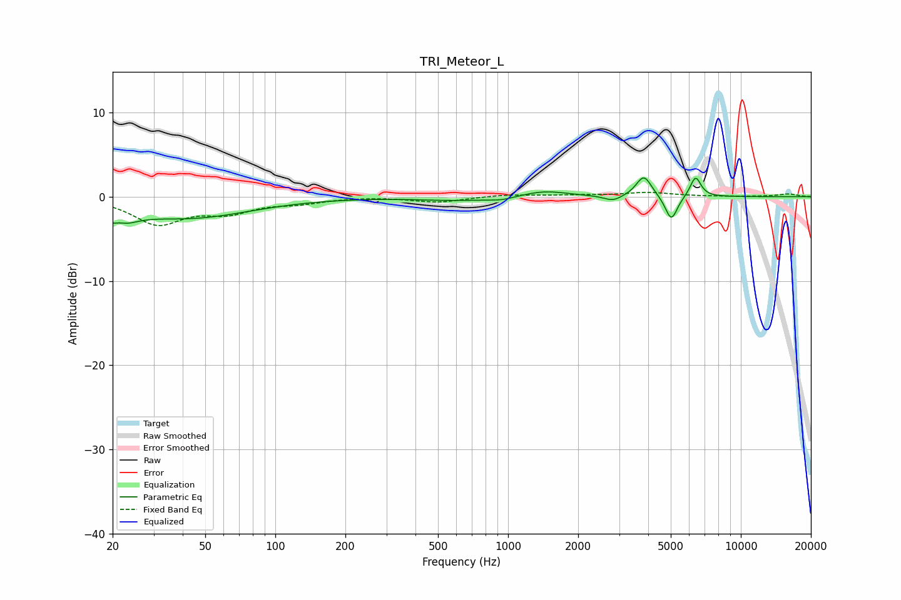

# TRI_Meteor_L
See [usage instructions](https://github.com/jaakkopasanen/AutoEq#usage) for more options and info.

### Parametric EQs
Apply preamp of -2.3 dB when using parametric equalizer.

|   # | Type    |   Fc (Hz) |    Q |   Gain (dB) |
|-----|---------|-----------|------|-------------|
|   1 | Peaking |        21 | 2.35 |        -2.8 |
|   2 | Peaking |        21 | 4.32 |         1.1 |
|   3 | Peaking |        43 | 0.53 |        -2.4 |
|   4 | Peaking |       613 | 0.86 |        -0.4 |
|   5 | Peaking |       940 | 2.7  |        -0.3 |
|   6 | Peaking |      1435 | 1.43 |         0.7 |
|   7 | Peaking |      2824 | 3.7  |        -0.7 |
|   8 | Peaking |      3834 | 4.3  |         2.5 |
|   9 | Peaking |      5027 | 5.34 |        -3   |
|  10 | Peaking |      6388 | 6    |         2.4 |

### Fixed Band EQs
When using fixed band (also called graphic) equalizer, apply preamp of **-0.6 dB** (if available) and set gains manually with these parameters.

|   # | Type    |   Fc (Hz) |    Q |   Gain (dB) |
|-----|---------|-----------|------|-------------|
|   1 | Peaking |        31 | 1.41 |        -3.1 |
|   2 | Peaking |        62 | 1.41 |        -1.6 |
|   3 | Peaking |       125 | 1.41 |        -0.6 |
|   4 | Peaking |       250 | 1.41 |         0   |
|   5 | Peaking |       500 | 1.41 |        -0.6 |
|   6 | Peaking |      1000 | 1.41 |         0.3 |
|   7 | Peaking |      2000 | 1.41 |         0.1 |
|   8 | Peaking |      4000 | 1.41 |         0.5 |
|   9 | Peaking |      8000 | 1.41 |         0   |
|  10 | Peaking |     16000 | 1.41 |         0.3 |

### Graphs

