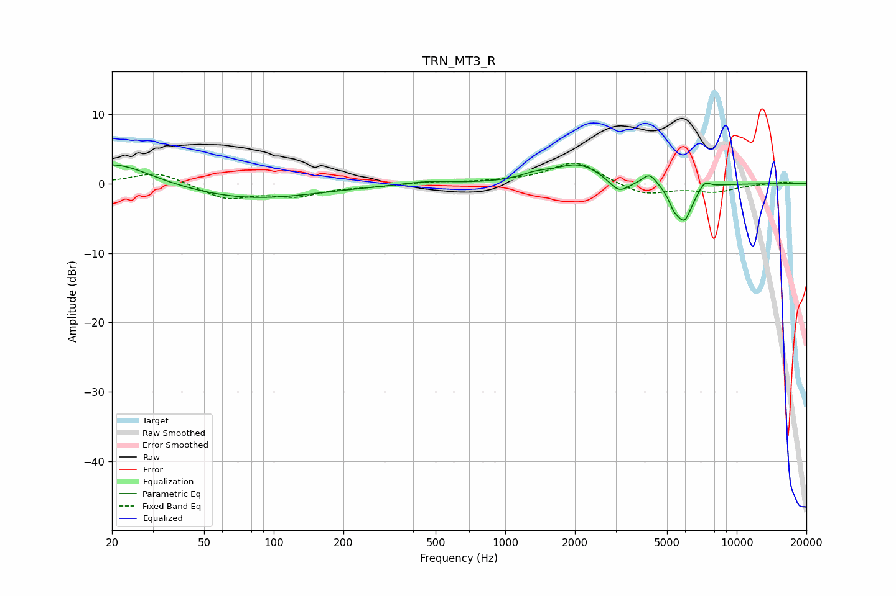

# TRN_MT3_R
See [usage instructions](https://github.com/jaakkopasanen/AutoEq#usage) for more options and info.

### Parametric EQs
Apply preamp of -2.8 dB when using parametric equalizer.

|   # | Type    |   Fc (Hz) |    Q |   Gain (dB) |
|-----|---------|-----------|------|-------------|
|   1 | Peaking |        21 | 0.9  |         3.3 |
|   2 | Peaking |        78 | 0.49 |        -2.2 |
|   3 | Peaking |       456 | 1.5  |         0.4 |
|   4 | Peaking |      1355 | 2.15 |         0.8 |
|   5 | Peaking |      2074 | 1.37 |         2.8 |
|   6 | Peaking |      3095 | 3.29 |        -2   |
|   7 | Peaking |      4203 | 4.68 |         1.6 |
|   8 | Peaking |      5341 | 5.99 |        -1.7 |
|   9 | Peaking |      5939 | 3.84 |        -5.1 |
|  10 | Peaking |      7274 | 5.73 |         1.1 |

### Fixed Band EQs
When using fixed band (also called graphic) equalizer, apply preamp of **-3.1 dB** (if available) and set gains manually with these parameters.

|   # | Type    |   Fc (Hz) |    Q |   Gain (dB) |
|-----|---------|-----------|------|-------------|
|   1 | Peaking |        31 | 1.41 |         1.8 |
|   2 | Peaking |        62 | 1.41 |        -2.1 |
|   3 | Peaking |       125 | 1.41 |        -1.6 |
|   4 | Peaking |       250 | 1.41 |        -0.3 |
|   5 | Peaking |       500 | 1.41 |         0.3 |
|   6 | Peaking |      1000 | 1.41 |         0.2 |
|   7 | Peaking |      2000 | 1.41 |         3.2 |
|   8 | Peaking |      4000 | 1.41 |        -1.7 |
|   9 | Peaking |      8000 | 1.41 |        -1.1 |
|  10 | Peaking |     16000 | 1.41 |         0.3 |

### Graphs

