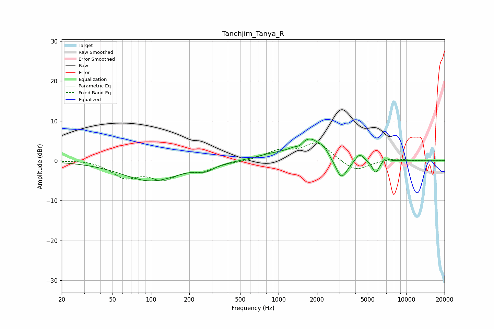

# Tanchjim_Tanya_R
See [usage instructions](https://github.com/jaakkopasanen/AutoEq#usage) for more options and info.

### Parametric EQs
Apply preamp of -5.5 dB when using parametric equalizer.

|   # | Type    |   Fc (Hz) |    Q |   Gain (dB) |
|-----|---------|-----------|------|-------------|
|   1 | Peaking |       100 | 0.63 |        -5   |
|   2 | Peaking |       270 | 2.42 |        -1.4 |
|   3 | Peaking |       864 | 1.08 |         1.1 |
|   4 | Peaking |      1465 | 5.39 |        -0.9 |
|   5 | Peaking |      1748 | 1.37 |         5.6 |
|   6 | Peaking |      2266 | 4.45 |         0.9 |
|   7 | Peaking |      3104 | 2.96 |        -5.6 |
|   8 | Peaking |      4322 | 4.42 |         2.1 |
|   9 | Peaking |      5771 | 5.03 |        -3.2 |
|  10 | Peaking |      6909 | 6    |         0.9 |

### Fixed Band EQs
When using fixed band (also called graphic) equalizer, apply preamp of **-4.6 dB** (if available) and set gains manually with these parameters.

|   # | Type    |   Fc (Hz) |    Q |   Gain (dB) |
|-----|---------|-----------|------|-------------|
|   1 | Peaking |        31 | 1.41 |         0.4 |
|   2 | Peaking |        62 | 1.41 |        -3.8 |
|   3 | Peaking |       125 | 1.41 |        -4   |
|   4 | Peaking |       250 | 1.41 |        -2.1 |
|   5 | Peaking |       500 | 1.41 |        -0.2 |
|   6 | Peaking |      1000 | 1.41 |         2.2 |
|   7 | Peaking |      2000 | 1.41 |         4.5 |
|   8 | Peaking |      4000 | 1.41 |        -2.9 |
|   9 | Peaking |      8000 | 1.41 |         0.6 |
|  10 | Peaking |     16000 | 1.41 |        -0   |

### Graphs

