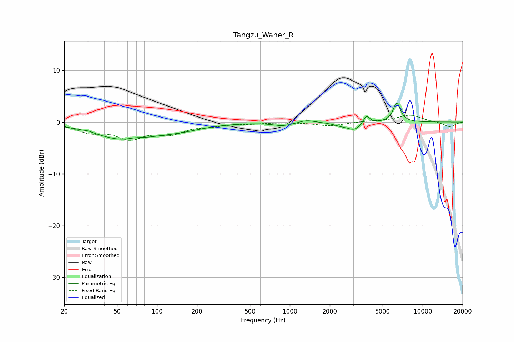

# Tangzu_Waner_R
See [usage instructions](https://github.com/jaakkopasanen/AutoEq#usage) for more options and info.

### Parametric EQs
Apply preamp of -3.7 dB when using parametric equalizer.

|   # | Type    |   Fc (Hz) |    Q |   Gain (dB) |
|-----|---------|-----------|------|-------------|
|   1 | Peaking |        30 | 5.13 |         0.2 |
|   2 | Peaking |        57 | 0.65 |        -3.3 |
|   3 | Peaking |        68 | 2.14 |         0.5 |
|   4 | Peaking |       150 | 0.78 |        -1   |
|   5 | Peaking |       884 | 2    |        -0.7 |
|   6 | Peaking |      1340 | 2.47 |         0.5 |
|   7 | Peaking |      2405 | 2.74 |        -0.4 |
|   8 | Peaking |      3061 | 2.68 |        -1.5 |
|   9 | Peaking |      3776 | 5.97 |         1.6 |
|  10 | Peaking |      6388 | 4.88 |         3.7 |

### Fixed Band EQs
When using fixed band (also called graphic) equalizer, apply preamp of **-1.4 dB** (if available) and set gains manually with these parameters.

|   # | Type    |   Fc (Hz) |    Q |   Gain (dB) |
|-----|---------|-----------|------|-------------|
|   1 | Peaking |        31 | 1.41 |        -1.7 |
|   2 | Peaking |        62 | 1.41 |        -2.9 |
|   3 | Peaking |       125 | 1.41 |        -1.9 |
|   4 | Peaking |       250 | 1.41 |        -0.6 |
|   5 | Peaking |       500 | 1.41 |        -0.2 |
|   6 | Peaking |      1000 | 1.41 |         0   |
|   7 | Peaking |      2000 | 1.41 |        -0.7 |
|   8 | Peaking |      4000 | 1.41 |         0.2 |
|   9 | Peaking |      8000 | 1.41 |         1.4 |
|  10 | Peaking |     16000 | 1.41 |        -1   |

### Graphs

