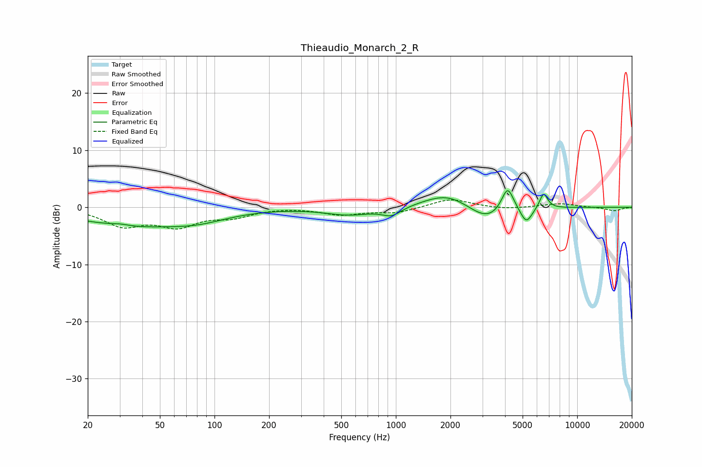

# Thieaudio_Monarch_2_R
See [usage instructions](https://github.com/jaakkopasanen/AutoEq#usage) for more options and info.

### Parametric EQs
Apply preamp of -3.0 dB when using parametric equalizer.

|   # | Type    |   Fc (Hz) |    Q |   Gain (dB) |
|-----|---------|-----------|------|-------------|
|   1 | Peaking |        30 | 2.5  |         0.4 |
|   2 | Peaking |        33 | 0.49 |        -3   |
|   3 | Peaking |        81 | 0.84 |        -1.5 |
|   4 | Peaking |       554 | 1.08 |        -1.3 |
|   5 | Peaking |       948 | 2.69 |        -1.4 |
|   6 | Peaking |      1926 | 1.09 |         2.7 |
|   7 | Peaking |      3186 | 1.34 |        -2.9 |
|   8 | Peaking |      4132 | 4.08 |         4.6 |
|   9 | Peaking |      5244 | 4.28 |        -2.8 |
|  10 | Peaking |      6526 | 6    |         2.8 |

### Fixed Band EQs
When using fixed band (also called graphic) equalizer, apply preamp of **-1.4 dB** (if available) and set gains manually with these parameters.

|   # | Type    |   Fc (Hz) |    Q |   Gain (dB) |
|-----|---------|-----------|------|-------------|
|   1 | Peaking |        31 | 1.41 |        -3   |
|   2 | Peaking |        62 | 1.41 |        -3   |
|   3 | Peaking |       125 | 1.41 |        -1.5 |
|   4 | Peaking |       250 | 1.41 |         0.1 |
|   5 | Peaking |       500 | 1.41 |        -1.2 |
|   6 | Peaking |      1000 | 1.41 |        -0.9 |
|   7 | Peaking |      2000 | 1.41 |         1.5 |
|   8 | Peaking |      4000 | 1.41 |        -0.4 |
|   9 | Peaking |      8000 | 1.41 |         0.6 |
|  10 | Peaking |     16000 | 1.41 |        -0.6 |

### Graphs

