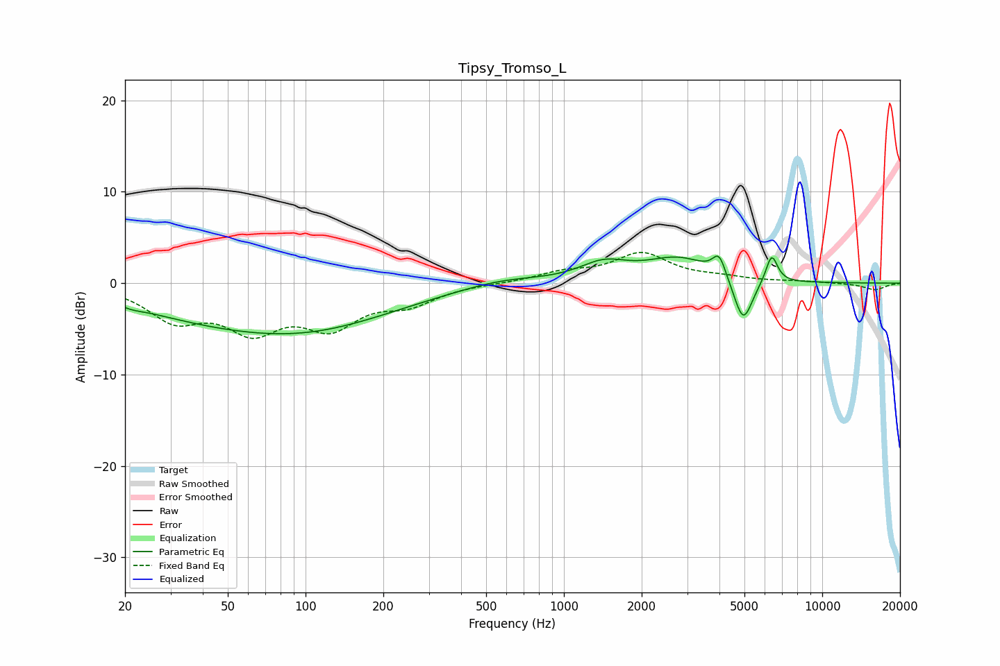

# Tipsy_Tromso_L
See [usage instructions](https://github.com/jaakkopasanen/AutoEq#usage) for more options and info.

### Parametric EQs
Apply preamp of -3.0 dB when using parametric equalizer.

|   # | Type    |   Fc (Hz) |    Q |   Gain (dB) |
|-----|---------|-----------|------|-------------|
|   1 | Peaking |        21 | 3.55 |        -0.3 |
|   2 | Peaking |        29 | 0.6  |        -0.9 |
|   3 | Peaking |        84 | 0.36 |        -5   |
|   4 | Peaking |       115 | 0.64 |        -0.3 |
|   5 | Peaking |       575 | 0.89 |         0.8 |
|   6 | Peaking |      1425 | 1.51 |         1.9 |
|   7 | Peaking |      2792 | 1.1  |         2.6 |
|   8 | Peaking |      3989 | 5.52 |         2.4 |
|   9 | Peaking |      4945 | 3.81 |        -5   |
|  10 | Peaking |      6373 | 6    |         3.1 |

### Fixed Band EQs
When using fixed band (also called graphic) equalizer, apply preamp of **-3.5 dB** (if available) and set gains manually with these parameters.

|   # | Type    |   Fc (Hz) |    Q |   Gain (dB) |
|-----|---------|-----------|------|-------------|
|   1 | Peaking |        31 | 1.41 |        -3.6 |
|   2 | Peaking |        62 | 1.41 |        -4.5 |
|   3 | Peaking |       125 | 1.41 |        -4.2 |
|   4 | Peaking |       250 | 1.41 |        -2   |
|   5 | Peaking |       500 | 1.41 |        -0   |
|   6 | Peaking |      1000 | 1.41 |         1   |
|   7 | Peaking |      2000 | 1.41 |         3.1 |
|   8 | Peaking |      4000 | 1.41 |         0.5 |
|   9 | Peaking |      8000 | 1.41 |         0.2 |
|  10 | Peaking |     16000 | 1.41 |        -0.7 |

### Graphs

