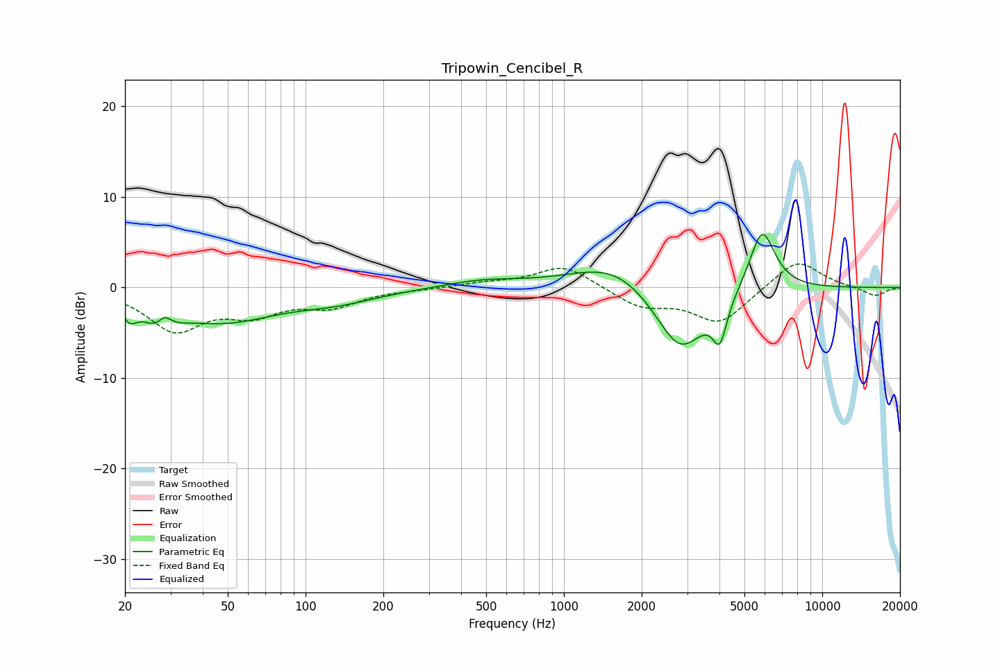

# Tripowin_Cencibel_R
See [usage instructions](https://github.com/jaakkopasanen/AutoEq#usage) for more options and info.

### Parametric EQs
Apply preamp of -6.0 dB when using parametric equalizer.

|   # | Type    |   Fc (Hz) |    Q |   Gain (dB) |
|-----|---------|-----------|------|-------------|
|   1 | Peaking |        21 | 4.95 |        -1.8 |
|   2 | Peaking |        28 | 2.69 |        -3.5 |
|   3 | Peaking |        28 | 4.5  |         2.6 |
|   4 | Peaking |        48 | 0.68 |        -3.5 |
|   5 | Peaking |       132 | 0.85 |        -1.2 |
|   6 | Peaking |       486 | 0.96 |         0.8 |
|   7 | Peaking |      1598 | 0.85 |         3.2 |
|   8 | Peaking |      2818 | 1.36 |        -7.8 |
|   9 | Peaking |      4015 | 5.13 |        -4.3 |
|  10 | Peaking |      5851 | 2.71 |         7.1 |

### Fixed Band EQs
When using fixed band (also called graphic) equalizer, apply preamp of **-2.7 dB** (if available) and set gains manually with these parameters.

|   # | Type    |   Fc (Hz) |    Q |   Gain (dB) |
|-----|---------|-----------|------|-------------|
|   1 | Peaking |        31 | 1.41 |        -4.5 |
|   2 | Peaking |        62 | 1.41 |        -2.5 |
|   3 | Peaking |       125 | 1.41 |        -1.9 |
|   4 | Peaking |       250 | 1.41 |        -0.1 |
|   5 | Peaking |       500 | 1.41 |         0.5 |
|   6 | Peaking |      1000 | 1.41 |         2.5 |
|   7 | Peaking |      2000 | 1.41 |        -2   |
|   8 | Peaking |      4000 | 1.41 |        -3.9 |
|   9 | Peaking |      8000 | 1.41 |         3.2 |
|  10 | Peaking |     16000 | 1.41 |        -1   |

### Graphs

