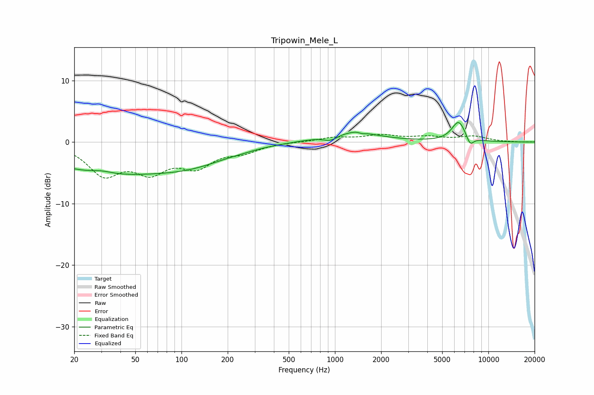

# Tripowin_Mele_L
See [usage instructions](https://github.com/jaakkopasanen/AutoEq#usage) for more options and info.

### Parametric EQs
Apply preamp of -3.3 dB when using parametric equalizer.

|   # | Type    |   Fc (Hz) |    Q |   Gain (dB) |
|-----|---------|-----------|------|-------------|
|   1 | Peaking |        30 | 2.12 |         0.5 |
|   2 | Peaking |        32 | 0.35 |        -4.7 |
|   3 | Peaking |       120 | 0.57 |        -2.5 |
|   4 | Peaking |       248 | 2.36 |        -0.1 |
|   5 | Peaking |       939 | 2.87 |        -1   |
|   6 | Peaking |      1240 | 0.8  |         1.7 |
|   7 | Peaking |      1458 | 3.9  |         0.7 |
|   8 | Peaking |      1484 | 5.07 |        -0.7 |
|   9 | Peaking |      6394 | 3.05 |         3.3 |
|  10 | Peaking |      7597 | 5.76 |        -1.5 |

### Fixed Band EQs
When using fixed band (also called graphic) equalizer, apply preamp of **-1.3 dB** (if available) and set gains manually with these parameters.

|   # | Type    |   Fc (Hz) |    Q |   Gain (dB) |
|-----|---------|-----------|------|-------------|
|   1 | Peaking |        31 | 1.41 |        -4.9 |
|   2 | Peaking |        62 | 1.41 |        -4.1 |
|   3 | Peaking |       125 | 1.41 |        -3.5 |
|   4 | Peaking |       250 | 1.41 |        -1.3 |
|   5 | Peaking |       500 | 1.41 |         0   |
|   6 | Peaking |      1000 | 1.41 |         0.7 |
|   7 | Peaking |      2000 | 1.41 |         1   |
|   8 | Peaking |      4000 | 1.41 |         0.7 |
|   9 | Peaking |      8000 | 1.41 |         0.9 |
|  10 | Peaking |     16000 | 1.41 |        -0   |

### Graphs

