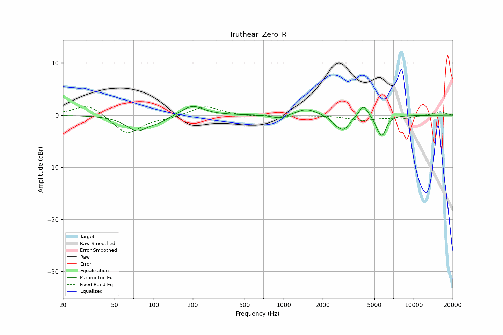

# Truthear_Zero_R
See [usage instructions](https://github.com/jaakkopasanen/AutoEq#usage) for more options and info.

### Parametric EQs
Apply preamp of -1.7 dB when using parametric equalizer.

|   # | Type    |   Fc (Hz) |    Q |   Gain (dB) |
|-----|---------|-----------|------|-------------|
|   1 | Peaking |        75 | 1.68 |        -2.9 |
|   2 | Peaking |       110 | 2.12 |        -0.8 |
|   3 | Peaking |       199 | 1.75 |         1.9 |
|   4 | Peaking |       928 | 2.53 |        -0.7 |
|   5 | Peaking |      1504 | 1.89 |         1.3 |
|   6 | Peaking |      2491 | 4.48 |        -0.7 |
|   7 | Peaking |      2886 | 2.95 |        -2.8 |
|   8 | Peaking |      4114 | 4.18 |         2.3 |
|   9 | Peaking |      5258 | 6    |        -0.9 |
|  10 | Peaking |      5735 | 4.46 |        -3.6 |

### Fixed Band EQs
When using fixed band (also called graphic) equalizer, apply preamp of **-1.7 dB** (if available) and set gains manually with these parameters.

|   # | Type    |   Fc (Hz) |    Q |   Gain (dB) |
|-----|---------|-----------|------|-------------|
|   1 | Peaking |        31 | 1.41 |         2.2 |
|   2 | Peaking |        62 | 1.41 |        -3.7 |
|   3 | Peaking |       125 | 1.41 |        -0.5 |
|   4 | Peaking |       250 | 1.41 |         1.8 |
|   5 | Peaking |       500 | 1.41 |        -0.2 |
|   6 | Peaking |      1000 | 1.41 |        -0.2 |
|   7 | Peaking |      2000 | 1.41 |        -0   |
|   8 | Peaking |      4000 | 1.41 |        -0.9 |
|   9 | Peaking |      8000 | 1.41 |        -0.6 |
|  10 | Peaking |     16000 | 1.41 |         0.7 |

### Graphs

