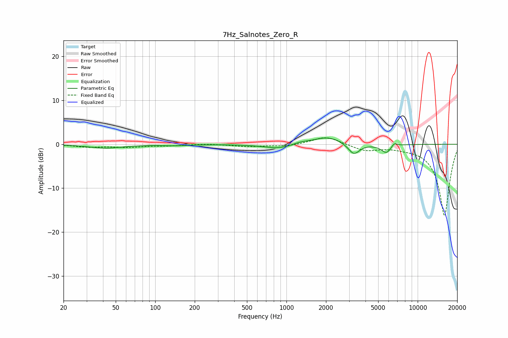

# 7Hz_Salnotes_Zero_R
See [usage instructions](https://github.com/jaakkopasanen/AutoEq#usage) for more options and info.

### Parametric EQs
Apply preamp of -1.5 dB when using parametric equalizer.

|   # | Type    |   Fc (Hz) |    Q |   Gain (dB) |
|-----|---------|-----------|------|-------------|
|   1 | Peaking |        42 | 1.07 |        -0.9 |
|   2 | Peaking |       138 | 1.39 |        -0.3 |
|   3 | Peaking |       884 | 1.27 |        -0.9 |
|   4 | Peaking |       990 | 0.95 |        -0.3 |
|   5 | Peaking |      1276 | 1.84 |         0.7 |
|   6 | Peaking |      1978 | 1.58 |         1.5 |
|   7 | Peaking |      2433 | 2.49 |         0.4 |
|   8 | Peaking |      3267 | 3.35 |        -2.4 |
|   9 | Peaking |      5786 | 3.46 |        -2   |
|  10 | Peaking |      6616 | 6    |         1   |

### Fixed Band EQs
When using fixed band (also called graphic) equalizer, apply preamp of **-1.6 dB** (if available) and set gains manually with these parameters.

|   # | Type    |   Fc (Hz) |    Q |   Gain (dB) |
|-----|---------|-----------|------|-------------|
|   1 | Peaking |        31 | 1.41 |        -0.6 |
|   2 | Peaking |        62 | 1.41 |        -0.6 |
|   3 | Peaking |       125 | 1.41 |        -0.3 |
|   4 | Peaking |       250 | 1.41 |         0.1 |
|   5 | Peaking |       500 | 1.41 |        -0.5 |
|   6 | Peaking |      1000 | 1.41 |        -0.5 |
|   7 | Peaking |      2000 | 1.41 |         1.9 |
|   8 | Peaking |      4000 | 1.41 |        -1.4 |
|   9 | Peaking |      8000 | 1.41 |        -0.4 |
|  10 | Peaking |     16000 | 1.41 |       -16.4 |

### Graphs

