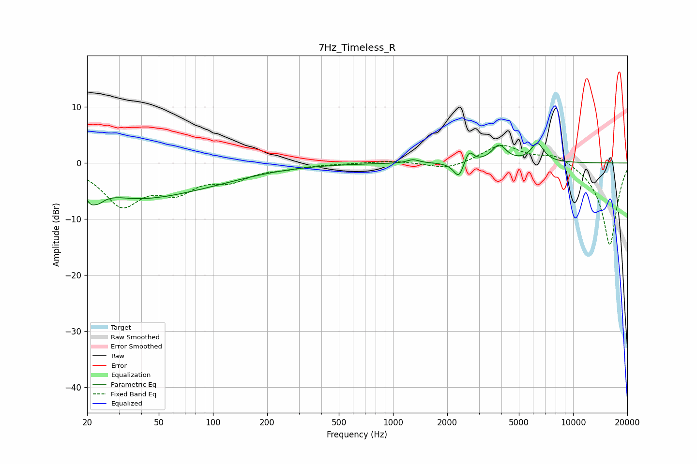

# 7Hz_Timeless_R
See [usage instructions](https://github.com/jaakkopasanen/AutoEq#usage) for more options and info.

### Parametric EQs
Apply preamp of -3.6 dB when using parametric equalizer.

|   # | Type    |   Fc (Hz) |    Q |   Gain (dB) |
|-----|---------|-----------|------|-------------|
|   1 | Peaking |        22 | 4.05 |        -6.1 |
|   2 | Peaking |        22 | 5.93 |         2.9 |
|   3 | Peaking |        36 | 0.84 |        -1.3 |
|   4 | Peaking |        50 | 0.36 |        -5   |
|   5 | Peaking |      1292 | 4.38 |         0.6 |
|   6 | Peaking |      2250 | 4.43 |        -0.8 |
|   7 | Peaking |      2332 | 5.76 |        -2.2 |
|   8 | Peaking |      2643 | 5.98 |         2.3 |
|   9 | Peaking |      3880 | 3.51 |         3   |
|  10 | Peaking |      6331 | 3.8  |         3.3 |

### Fixed Band EQs
When using fixed band (also called graphic) equalizer, apply preamp of **-3.2 dB** (if available) and set gains manually with these parameters.

|   # | Type    |   Fc (Hz) |    Q |   Gain (dB) |
|-----|---------|-----------|------|-------------|
|   1 | Peaking |        31 | 1.41 |        -7.1 |
|   2 | Peaking |        62 | 1.41 |        -4.2 |
|   3 | Peaking |       125 | 1.41 |        -2.6 |
|   4 | Peaking |       250 | 1.41 |        -0.7 |
|   5 | Peaking |       500 | 1.41 |        -0   |
|   6 | Peaking |      1000 | 1.41 |         0.4 |
|   7 | Peaking |      2000 | 1.41 |        -1.2 |
|   8 | Peaking |      4000 | 1.41 |         3.3 |
|   9 | Peaking |      8000 | 1.41 |         1.7 |
|  10 | Peaking |     16000 | 1.41 |       -14.8 |

### Graphs

