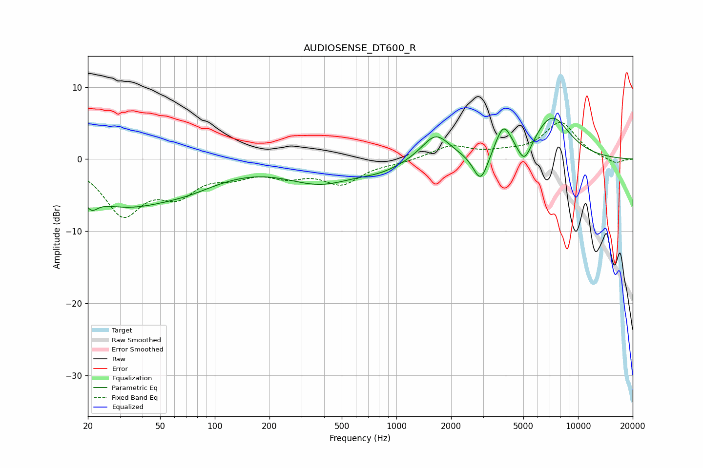

# AUDIOSENSE_DT600_R
See [usage instructions](https://github.com/jaakkopasanen/AutoEq#usage) for more options and info.

### Parametric EQs
Apply preamp of -5.8 dB when using parametric equalizer.

|   # | Type    |   Fc (Hz) |    Q |   Gain (dB) |
|-----|---------|-----------|------|-------------|
|   1 | Peaking |        21 | 3.95 |        -1.9 |
|   2 | Peaking |        31 | 0.53 |        -5.8 |
|   3 | Peaking |        72 | 0.73 |        -2   |
|   4 | Peaking |       381 | 0.75 |        -3.1 |
|   5 | Peaking |       825 | 1.14 |        -1.1 |
|   6 | Peaking |      1645 | 1.82 |         3.7 |
|   7 | Peaking |      2912 | 3.42 |        -4.2 |
|   8 | Peaking |      3886 | 3.13 |         4.2 |
|   9 | Peaking |      5069 | 3.58 |        -3.1 |
|  10 | Peaking |      7194 | 1.34 |         5.9 |

### Fixed Band EQs
When using fixed band (also called graphic) equalizer, apply preamp of **-5.2 dB** (if available) and set gains manually with these parameters.

|   # | Type    |   Fc (Hz) |    Q |   Gain (dB) |
|-----|---------|-----------|------|-------------|
|   1 | Peaking |        31 | 1.41 |        -7.3 |
|   2 | Peaking |        62 | 1.41 |        -4   |
|   3 | Peaking |       125 | 1.41 |        -1.7 |
|   4 | Peaking |       250 | 1.41 |        -1.9 |
|   5 | Peaking |       500 | 1.41 |        -3.1 |
|   6 | Peaking |      1000 | 1.41 |        -0.4 |
|   7 | Peaking |      2000 | 1.41 |         1.8 |
|   8 | Peaking |      4000 | 1.41 |         0.6 |
|   9 | Peaking |      8000 | 1.41 |         5   |
|  10 | Peaking |     16000 | 1.41 |        -0.7 |

### Graphs

