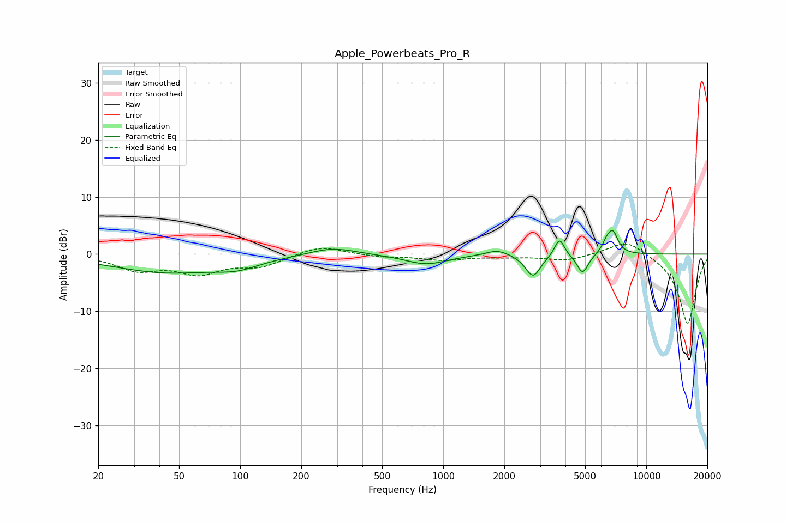

# Apple_Powerbeats_Pro_R
See [usage instructions](https://github.com/jaakkopasanen/AutoEq#usage) for more options and info.

### Parametric EQs
Apply preamp of -4.2 dB when using parametric equalizer.

|   # | Type    |   Fc (Hz) |    Q |   Gain (dB) |
|-----|---------|-----------|------|-------------|
|   1 | Peaking |        43 | 0.52 |        -3.1 |
|   2 | Peaking |        97 | 1.31 |        -1.4 |
|   3 | Peaking |       285 | 1.27 |         1.4 |
|   4 | Peaking |       824 | 1.36 |        -1.8 |
|   5 | Peaking |      1846 | 2.58 |         1   |
|   6 | Peaking |      2769 | 3.8  |        -3.9 |
|   7 | Peaking |      3737 | 5.91 |         3.2 |
|   8 | Peaking |      4858 | 5.02 |        -3.5 |
|   9 | Peaking |      6392 | 6    |         1.7 |
|  10 | Peaking |      6862 | 5.53 |         3.5 |

### Fixed Band EQs
When using fixed band (also called graphic) equalizer, apply preamp of **-1.9 dB** (if available) and set gains manually with these parameters.

|   # | Type    |   Fc (Hz) |    Q |   Gain (dB) |
|-----|---------|-----------|------|-------------|
|   1 | Peaking |        31 | 1.41 |        -2.6 |
|   2 | Peaking |        62 | 1.41 |        -3   |
|   3 | Peaking |       125 | 1.41 |        -2   |
|   4 | Peaking |       250 | 1.41 |         1.6 |
|   5 | Peaking |       500 | 1.41 |        -0.4 |
|   6 | Peaking |      1000 | 1.41 |        -1   |
|   7 | Peaking |      2000 | 1.41 |        -0.3 |
|   8 | Peaking |      4000 | 1.41 |        -1.1 |
|   9 | Peaking |      8000 | 1.41 |         2.7 |
|  10 | Peaking |     16000 | 1.41 |       -12.3 |

### Graphs

