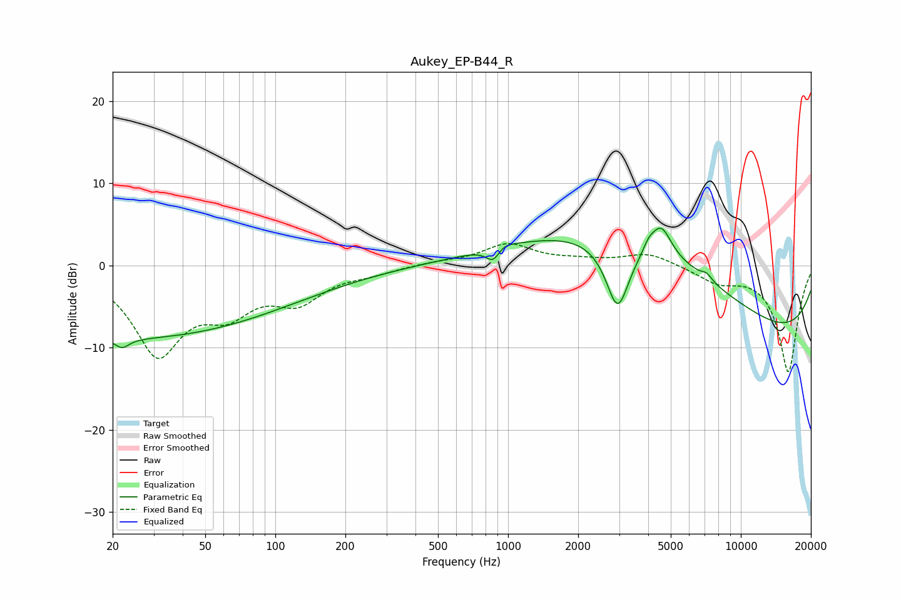

# Aukey_EP-B44_R
See [usage instructions](https://github.com/jaakkopasanen/AutoEq#usage) for more options and info.

### Parametric EQs
Apply preamp of -4.6 dB when using parametric equalizer.

|   # | Type    |   Fc (Hz) |    Q |   Gain (dB) |
|-----|---------|-----------|------|-------------|
|   1 | Peaking |        22 | 4.71 |        -1.1 |
|   2 | Peaking |        23 | 0.18 |        -8.8 |
|   3 | Peaking |       869 | 4.28 |        -2.6 |
|   4 | Peaking |       912 | 3.28 |         1.5 |
|   5 | Peaking |      2957 | 2.74 |        -8.5 |
|   6 | Peaking |      4018 | 5.98 |         1   |
|   7 | Peaking |      4104 | 0.3  |        10.6 |
|   8 | Peaking |      4545 | 3.16 |         3.9 |
|   9 | Peaking |      7139 | 5.75 |         0.7 |
|  10 | Peaking |     10000 | 0.21 |       -11.2 |

### Fixed Band EQs
When using fixed band (also called graphic) equalizer, apply preamp of **-2.7 dB** (if available) and set gains manually with these parameters.

|   # | Type    |   Fc (Hz) |    Q |   Gain (dB) |
|-----|---------|-----------|------|-------------|
|   1 | Peaking |        31 | 1.41 |       -10.4 |
|   2 | Peaking |        62 | 1.41 |        -4.4 |
|   3 | Peaking |       125 | 1.41 |        -3.8 |
|   4 | Peaking |       250 | 1.41 |        -0.7 |
|   5 | Peaking |       500 | 1.41 |         0.4 |
|   6 | Peaking |      1000 | 1.41 |         2.5 |
|   7 | Peaking |      2000 | 1.41 |         0.5 |
|   8 | Peaking |      4000 | 1.41 |         1.5 |
|   9 | Peaking |      8000 | 1.41 |        -1.8 |
|  10 | Peaking |     16000 | 1.41 |       -13   |

### Graphs

