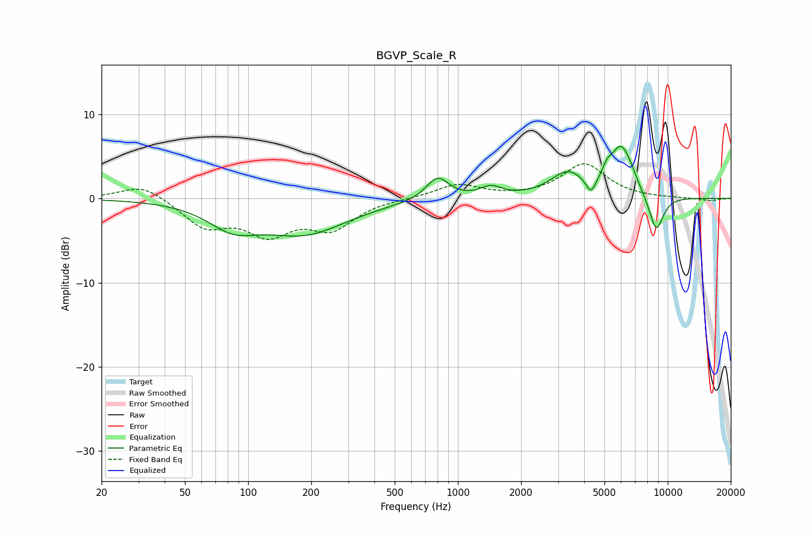

# BGVP_Scale_R
See [usage instructions](https://github.com/jaakkopasanen/AutoEq#usage) for more options and info.

### Parametric EQs
Apply preamp of -6.3 dB when using parametric equalizer.

|   # | Type    |   Fc (Hz) |    Q |   Gain (dB) |
|-----|---------|-----------|------|-------------|
|   1 | Peaking |        84 | 1.21 |        -2.6 |
|   2 | Peaking |       185 | 0.69 |        -3.9 |
|   3 | Peaking |       800 | 2.64 |         2.7 |
|   4 | Peaking |      1437 | 2.77 |         1.2 |
|   5 | Peaking |      3329 | 1.71 |         2.9 |
|   6 | Peaking |      4307 | 6    |        -1.8 |
|   7 | Peaking |      5144 | 5.99 |         1.3 |
|   8 | Peaking |      5982 | 2.7  |         5.5 |
|   9 | Peaking |      6737 | 4    |         0.8 |
|  10 | Peaking |      8818 | 3.64 |        -4.4 |

### Fixed Band EQs
When using fixed band (also called graphic) equalizer, apply preamp of **-4.2 dB** (if available) and set gains manually with these parameters.

|   # | Type    |   Fc (Hz) |    Q |   Gain (dB) |
|-----|---------|-----------|------|-------------|
|   1 | Peaking |        31 | 1.41 |         1.8 |
|   2 | Peaking |        62 | 1.41 |        -3.2 |
|   3 | Peaking |       125 | 1.41 |        -3.8 |
|   4 | Peaking |       250 | 1.41 |        -3.3 |
|   5 | Peaking |       500 | 1.41 |         0   |
|   6 | Peaking |      1000 | 1.41 |         1.7 |
|   7 | Peaking |      2000 | 1.41 |         0.1 |
|   8 | Peaking |      4000 | 1.41 |         4.1 |
|   9 | Peaking |      8000 | 1.41 |        -0   |
|  10 | Peaking |     16000 | 1.41 |        -0.3 |

### Graphs

