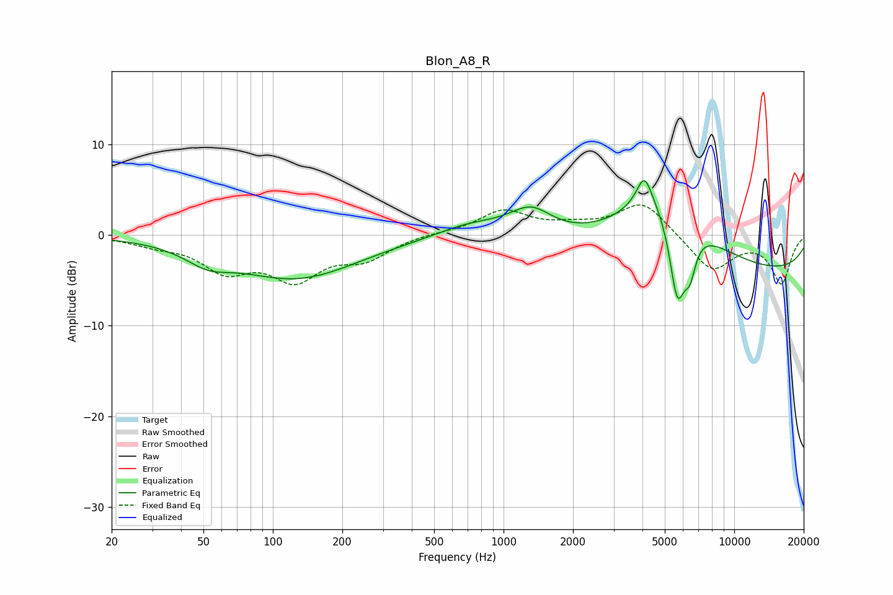

# Blon_A8_R
See [usage instructions](https://github.com/jaakkopasanen/AutoEq#usage) for more options and info.

### Parametric EQs
Apply preamp of -6.1 dB when using parametric equalizer.

|   # | Type    |   Fc (Hz) |    Q |   Gain (dB) |
|-----|---------|-----------|------|-------------|
|   1 | Peaking |        52 | 1.47 |        -1.7 |
|   2 | Peaking |       126 | 0.53 |        -4.7 |
|   3 | Peaking |       714 | 0.99 |         1.3 |
|   4 | Peaking |      1247 | 2.03 |        -0.9 |
|   5 | Peaking |      1288 | 1.6  |         3.8 |
|   6 | Peaking |      4071 | 4.28 |         3.3 |
|   7 | Peaking |      4894 | 0.76 |         8.5 |
|   8 | Peaking |      5663 | 3.67 |       -10   |
|   9 | Peaking |      6431 | 5.31 |        -3.6 |
|  10 | Peaking |      9874 | 0.18 |        -4.4 |

### Fixed Band EQs
When using fixed band (also called graphic) equalizer, apply preamp of **-3.4 dB** (if available) and set gains manually with these parameters.

|   # | Type    |   Fc (Hz) |    Q |   Gain (dB) |
|-----|---------|-----------|------|-------------|
|   1 | Peaking |        31 | 1.41 |        -0.8 |
|   2 | Peaking |        62 | 1.41 |        -3.5 |
|   3 | Peaking |       125 | 1.41 |        -4.4 |
|   4 | Peaking |       250 | 1.41 |        -2.3 |
|   5 | Peaking |       500 | 1.41 |         0.2 |
|   6 | Peaking |      1000 | 1.41 |         2.6 |
|   7 | Peaking |      2000 | 1.41 |         0.8 |
|   8 | Peaking |      4000 | 1.41 |         3.7 |
|   9 | Peaking |      8000 | 1.41 |        -4   |
|  10 | Peaking |     16000 | 1.41 |        -5.2 |

### Graphs

