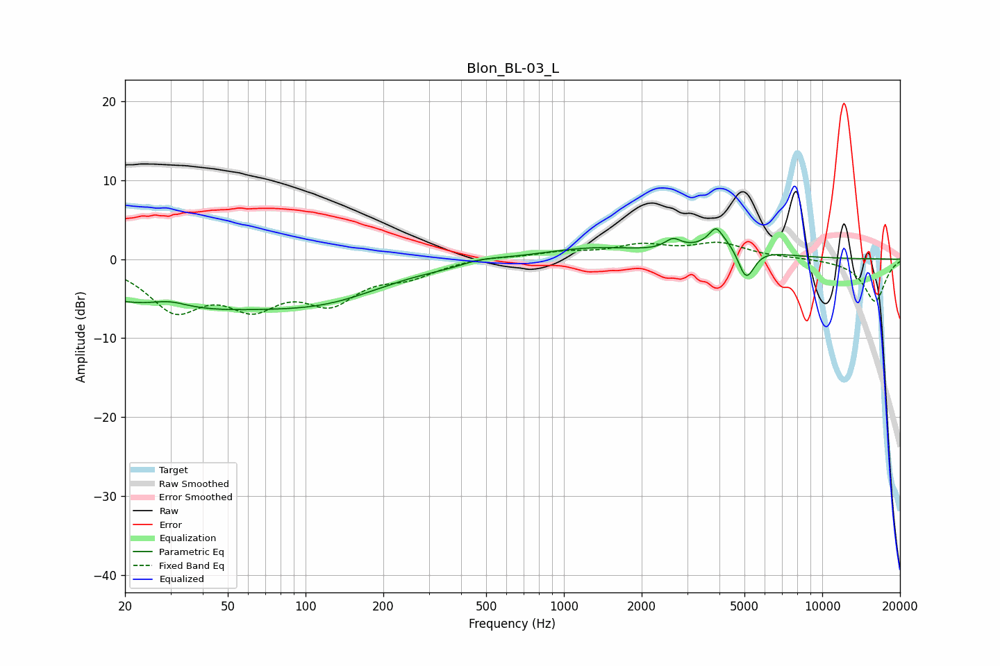

# Blon_BL-03_L
See [usage instructions](https://github.com/jaakkopasanen/AutoEq#usage) for more options and info.

### Parametric EQs
Apply preamp of -3.9 dB when using parametric equalizer.

|   # | Type    |   Fc (Hz) |    Q |   Gain (dB) |
|-----|---------|-----------|------|-------------|
|   1 | Peaking |        30 | 2.02 |         0.9 |
|   2 | Peaking |        31 | 0.31 |        -5.9 |
|   3 | Peaking |       126 | 0.6  |        -3.1 |
|   4 | Peaking |       379 | 1.52 |        -0.5 |
|   5 | Peaking |       450 | 1.51 |         0.7 |
|   6 | Peaking |      1292 | 0.71 |         1.4 |
|   7 | Peaking |      2645 | 4.53 |         1.3 |
|   8 | Peaking |      3874 | 5.62 |         1.9 |
|   9 | Peaking |      4504 | 1.35 |         2.8 |
|  10 | Peaking |      5066 | 3.99 |        -4.9 |

### Fixed Band EQs
When using fixed band (also called graphic) equalizer, apply preamp of **-2.2 dB** (if available) and set gains manually with these parameters.

|   # | Type    |   Fc (Hz) |    Q |   Gain (dB) |
|-----|---------|-----------|------|-------------|
|   1 | Peaking |        31 | 1.41 |        -5.9 |
|   2 | Peaking |        62 | 1.41 |        -4.9 |
|   3 | Peaking |       125 | 1.41 |        -4.7 |
|   4 | Peaking |       250 | 1.41 |        -1.8 |
|   5 | Peaking |       500 | 1.41 |         0.3 |
|   6 | Peaking |      1000 | 1.41 |         0.8 |
|   7 | Peaking |      2000 | 1.41 |         1.6 |
|   8 | Peaking |      4000 | 1.41 |         1.9 |
|   9 | Peaking |      8000 | 1.41 |         0.1 |
|  10 | Peaking |     16000 | 1.41 |        -5.4 |

### Graphs

