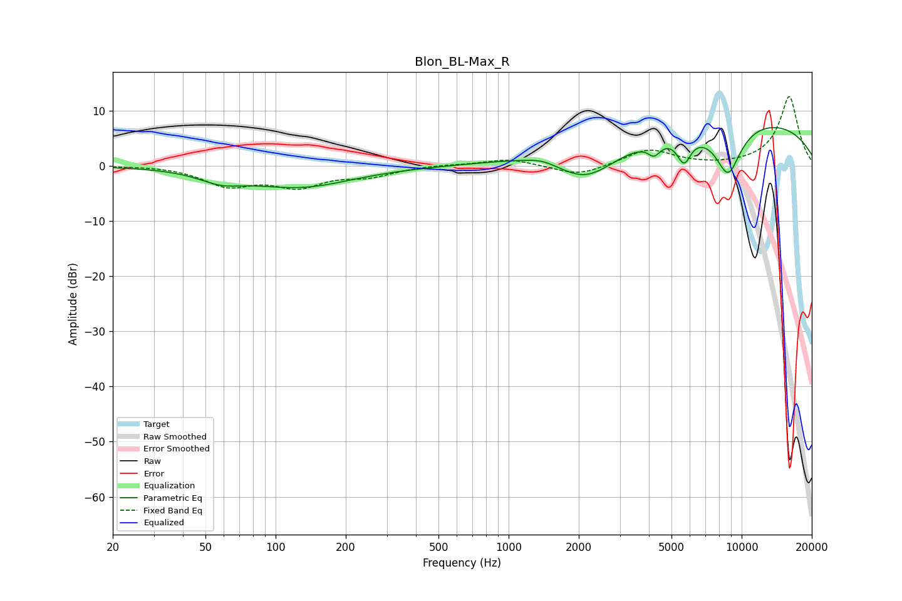

# Blon_BL-Max_R
See [usage instructions](https://github.com/jaakkopasanen/AutoEq#usage) for more options and info.

### Parametric EQs
Apply preamp of -7.0 dB when using parametric equalizer.

|   # | Type    |   Fc (Hz) |    Q |   Gain (dB) |
|-----|---------|-----------|------|-------------|
|   1 | Peaking |        58 | 1.5  |        -1.9 |
|   2 | Peaking |       127 | 0.63 |        -3.7 |
|   3 | Peaking |      1388 | 2.3  |         0.7 |
|   4 | Peaking |      1431 | 0.67 |         1.6 |
|   5 | Peaking |      2140 | 1.05 |        -6   |
|   6 | Peaking |      4211 | 5.26 |        -2.2 |
|   7 | Peaking |      5428 | 5.71 |        -0.3 |
|   8 | Peaking |      5672 | 4.7  |        -4.4 |
|   9 | Peaking |      8748 | 2.2  |        -9.2 |
|  10 | Peaking |      9888 | 0.24 |         8.5 |

### Fixed Band EQs
When using fixed band (also called graphic) equalizer, apply preamp of **-12.6 dB** (if available) and set gains manually with these parameters.

|   # | Type    |   Fc (Hz) |    Q |   Gain (dB) |
|-----|---------|-----------|------|-------------|
|   1 | Peaking |        31 | 1.41 |         0.1 |
|   2 | Peaking |        62 | 1.41 |        -3.4 |
|   3 | Peaking |       125 | 1.41 |        -3.4 |
|   4 | Peaking |       250 | 1.41 |        -1.6 |
|   5 | Peaking |       500 | 1.41 |         0.2 |
|   6 | Peaking |      1000 | 1.41 |         1.3 |
|   7 | Peaking |      2000 | 1.41 |        -1.9 |
|   8 | Peaking |      4000 | 1.41 |         3   |
|   9 | Peaking |      8000 | 1.41 |        -0.1 |
|  10 | Peaking |     16000 | 1.41 |        12.6 |

### Graphs

