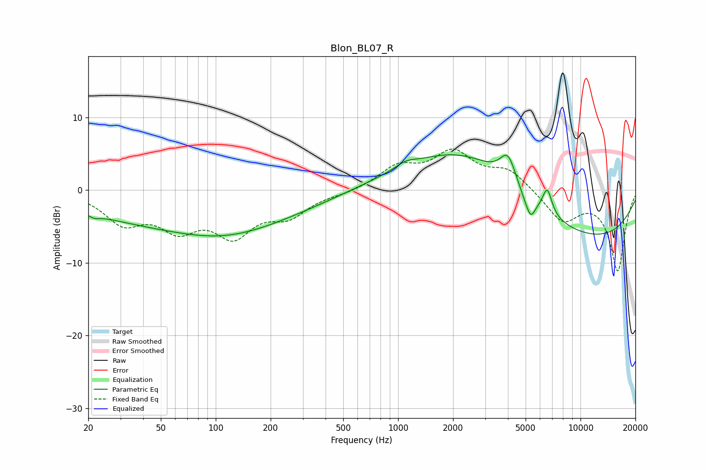

# Blon_BL07_R
See [usage instructions](https://github.com/jaakkopasanen/AutoEq#usage) for more options and info.

### Parametric EQs
Apply preamp of -5.0 dB when using parametric equalizer.

|   # | Type    |   Fc (Hz) |    Q |   Gain (dB) |
|-----|---------|-----------|------|-------------|
|   1 | Peaking |        22 | 5.06 |        -0.5 |
|   2 | Peaking |        76 | 0.21 |        -4.8 |
|   3 | Peaking |       112 | 0.56 |        -1.7 |
|   4 | Peaking |      1098 | 2.71 |         0.7 |
|   5 | Peaking |      2465 | 0.43 |         8.2 |
|   6 | Peaking |      4003 | 3.17 |         4   |
|   7 | Peaking |      4935 | 4.22 |        -0.6 |
|   8 | Peaking |      5336 | 5.49 |        -2.5 |
|   9 | Peaking |      6572 | 5.31 |         3.5 |
|  10 | Peaking |      9012 | 0.24 |        -7.5 |

### Fixed Band EQs
When using fixed band (also called graphic) equalizer, apply preamp of **-5.8 dB** (if available) and set gains manually with these parameters.

|   # | Type    |   Fc (Hz) |    Q |   Gain (dB) |
|-----|---------|-----------|------|-------------|
|   1 | Peaking |        31 | 1.41 |        -4.1 |
|   2 | Peaking |        62 | 1.41 |        -4.5 |
|   3 | Peaking |       125 | 1.41 |        -5.5 |
|   4 | Peaking |       250 | 1.41 |        -3.1 |
|   5 | Peaking |       500 | 1.41 |        -0.4 |
|   6 | Peaking |      1000 | 1.41 |         3   |
|   7 | Peaking |      2000 | 1.41 |         4.9 |
|   8 | Peaking |      4000 | 1.41 |         2.6 |
|   9 | Peaking |      8000 | 1.41 |        -4.2 |
|  10 | Peaking |     16000 | 1.41 |       -11   |

### Graphs

