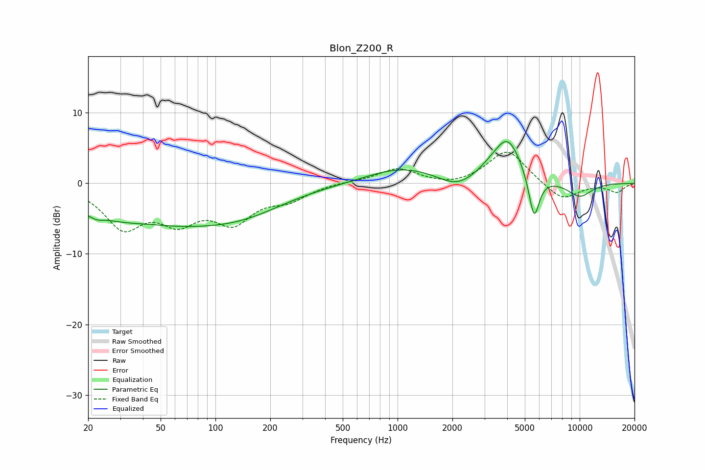

# Blon_Z200_R
See [usage instructions](https://github.com/jaakkopasanen/AutoEq#usage) for more options and info.

### Parametric EQs
Apply preamp of -6.0 dB when using parametric equalizer.

|   # | Type    |   Fc (Hz) |    Q |   Gain (dB) |
|-----|---------|-----------|------|-------------|
|   1 | Peaking |        22 | 4.8  |        -0.4 |
|   2 | Peaking |        41 | 0.34 |        -5.7 |
|   3 | Peaking |        44 | 1.09 |         0.5 |
|   4 | Peaking |       144 | 0.58 |        -2.7 |
|   5 | Peaking |      1068 | 0.73 |         2.2 |
|   6 | Peaking |      2116 | 1.46 |        -1.7 |
|   7 | Peaking |      3144 | 2.25 |         0.5 |
|   8 | Peaking |      4014 | 1.73 |         6.4 |
|   9 | Peaking |      5617 | 4.64 |        -6.5 |
|  10 | Peaking |     10000 | 1.76 |        -2   |

### Fixed Band EQs
When using fixed band (also called graphic) equalizer, apply preamp of **-4.5 dB** (if available) and set gains manually with these parameters.

|   # | Type    |   Fc (Hz) |    Q |   Gain (dB) |
|-----|---------|-----------|------|-------------|
|   1 | Peaking |        31 | 1.41 |        -5.8 |
|   2 | Peaking |        62 | 1.41 |        -4.5 |
|   3 | Peaking |       125 | 1.41 |        -4.8 |
|   4 | Peaking |       250 | 1.41 |        -2   |
|   5 | Peaking |       500 | 1.41 |         0.2 |
|   6 | Peaking |      1000 | 1.41 |         2.1 |
|   7 | Peaking |      2000 | 1.41 |        -0.6 |
|   8 | Peaking |      4000 | 1.41 |         4.8 |
|   9 | Peaking |      8000 | 1.41 |        -2.5 |
|  10 | Peaking |     16000 | 1.41 |        -1.2 |

### Graphs

