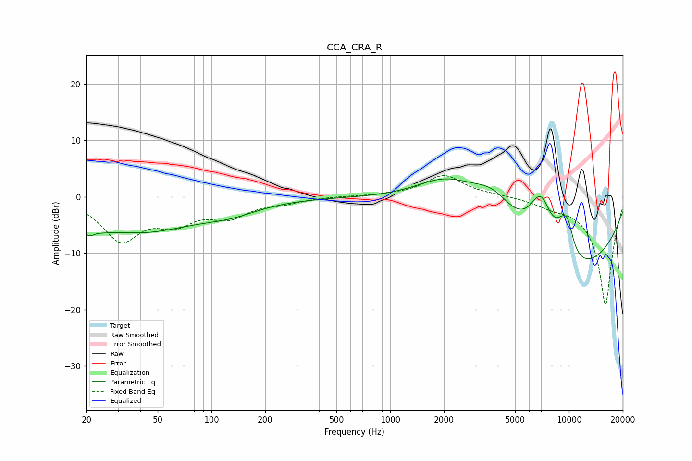

# CCA_CRA_R
See [usage instructions](https://github.com/jaakkopasanen/AutoEq#usage) for more options and info.

### Parametric EQs
Apply preamp of -3.3 dB when using parametric equalizer.

|   # | Type    |   Fc (Hz) |    Q |   Gain (dB) |
|-----|---------|-----------|------|-------------|
|   1 | Peaking |        20 | 4.14 |        -2.1 |
|   2 | Peaking |        25 | 2.7  |        -0.6 |
|   3 | Peaking |        39 | 0.44 |        -6   |
|   4 | Peaking |       129 | 0.87 |        -1.6 |
|   5 | Peaking |      2083 | 0.72 |         6.9 |
|   6 | Peaking |      3761 | 1.03 |         6.8 |
|   7 | Peaking |      6947 | 1.8  |        10.7 |
|   8 | Peaking |      8574 | 0.27 |       -15.5 |
|   9 | Peaking |      9229 | 2.73 |         4.1 |
|  10 | Peaking |      9875 | 3.91 |         3.7 |

### Fixed Band EQs
When using fixed band (also called graphic) equalizer, apply preamp of **-3.9 dB** (if available) and set gains manually with these parameters.

|   # | Type    |   Fc (Hz) |    Q |   Gain (dB) |
|-----|---------|-----------|------|-------------|
|   1 | Peaking |        31 | 1.41 |        -7.3 |
|   2 | Peaking |        62 | 1.41 |        -3.8 |
|   3 | Peaking |       125 | 1.41 |        -3.1 |
|   4 | Peaking |       250 | 1.41 |        -0.9 |
|   5 | Peaking |       500 | 1.41 |         0.1 |
|   6 | Peaking |      1000 | 1.41 |         0.2 |
|   7 | Peaking |      2000 | 1.41 |         3.8 |
|   8 | Peaking |      4000 | 1.41 |         0.3 |
|   9 | Peaking |      8000 | 1.41 |        -1   |
|  10 | Peaking |     16000 | 1.41 |       -19.2 |

### Graphs

