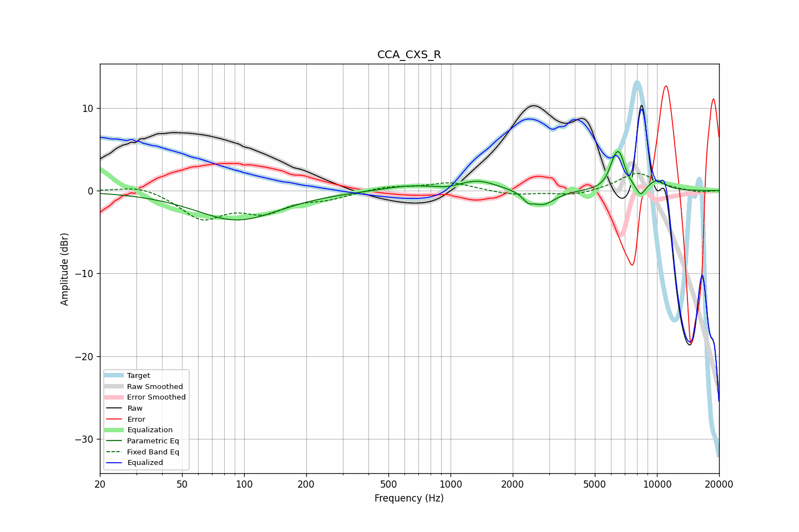

# CCA_CXS_R
See [usage instructions](https://github.com/jaakkopasanen/AutoEq#usage) for more options and info.

### Parametric EQs
Apply preamp of -4.8 dB when using parametric equalizer.

|   # | Type    |   Fc (Hz) |    Q |   Gain (dB) |
|-----|---------|-----------|------|-------------|
|   1 | Peaking |        93 | 0.7  |        -3.5 |
|   2 | Peaking |       622 | 1.09 |         0.6 |
|   3 | Peaking |       966 | 2.92 |        -0.2 |
|   4 | Peaking |      1362 | 1.52 |         1.2 |
|   5 | Peaking |      2370 | 5.94 |        -0.8 |
|   6 | Peaking |      2802 | 2.39 |        -1.8 |
|   7 | Peaking |      6122 | 5.97 |         1.1 |
|   8 | Peaking |      6542 | 4.53 |         4.1 |
|   9 | Peaking |      8337 | 6    |        -1.3 |
|  10 | Peaking |     10000 | 2.92 |         1.2 |

### Fixed Band EQs
When using fixed band (also called graphic) equalizer, apply preamp of **-2.2 dB** (if available) and set gains manually with these parameters.

|   # | Type    |   Fc (Hz) |    Q |   Gain (dB) |
|-----|---------|-----------|------|-------------|
|   1 | Peaking |        31 | 1.41 |         0.8 |
|   2 | Peaking |        62 | 1.41 |        -3.2 |
|   3 | Peaking |       125 | 1.41 |        -2.3 |
|   4 | Peaking |       250 | 1.41 |        -0.8 |
|   5 | Peaking |       500 | 1.41 |         0.5 |
|   6 | Peaking |      1000 | 1.41 |         1   |
|   7 | Peaking |      2000 | 1.41 |        -0.5 |
|   8 | Peaking |      4000 | 1.41 |        -0.6 |
|   9 | Peaking |      8000 | 1.41 |         2.2 |
|  10 | Peaking |     16000 | 1.41 |        -0.2 |

### Graphs

