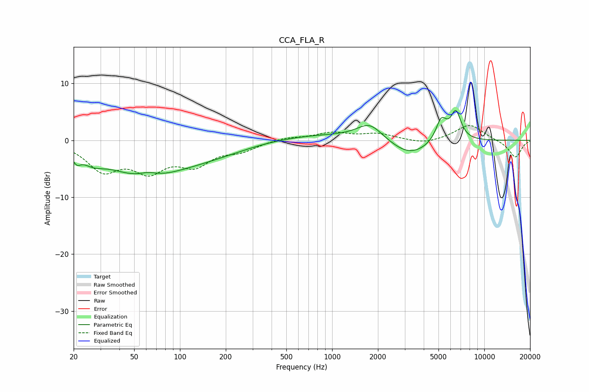

# CCA_FLA_R
See [usage instructions](https://github.com/jaakkopasanen/AutoEq#usage) for more options and info.

### Parametric EQs
Apply preamp of -5.3 dB when using parametric equalizer.

|   # | Type    |   Fc (Hz) |    Q |   Gain (dB) |
|-----|---------|-----------|------|-------------|
|   1 | Peaking |        21 | 5.68 |        -1.4 |
|   2 | Peaking |        27 | 1.94 |        -1.6 |
|   3 | Peaking |        57 | 0.59 |        -5.6 |
|   4 | Peaking |        62 | 2.23 |         0.9 |
|   5 | Peaking |       159 | 0.48 |        -2.3 |
|   6 | Peaking |       678 | 0.32 |         1.2 |
|   7 | Peaking |      1771 | 1.7  |         2.8 |
|   8 | Peaking |      3227 | 1.07 |        -3   |
|   9 | Peaking |      5219 | 3.87 |         3.9 |
|  10 | Peaking |      6505 | 3.92 |         5   |

### Fixed Band EQs
When using fixed band (also called graphic) equalizer, apply preamp of **-2.7 dB** (if available) and set gains manually with these parameters.

|   # | Type    |   Fc (Hz) |    Q |   Gain (dB) |
|-----|---------|-----------|------|-------------|
|   1 | Peaking |        31 | 1.41 |        -4.9 |
|   2 | Peaking |        62 | 1.41 |        -4.7 |
|   3 | Peaking |       125 | 1.41 |        -3.8 |
|   4 | Peaking |       250 | 1.41 |        -1.5 |
|   5 | Peaking |       500 | 1.41 |         0.6 |
|   6 | Peaking |      1000 | 1.41 |         1.3 |
|   7 | Peaking |      2000 | 1.41 |         1.1 |
|   8 | Peaking |      4000 | 1.41 |        -0.7 |
|   9 | Peaking |      8000 | 1.41 |         2.8 |
|  10 | Peaking |     16000 | 1.41 |        -3.1 |

### Graphs

