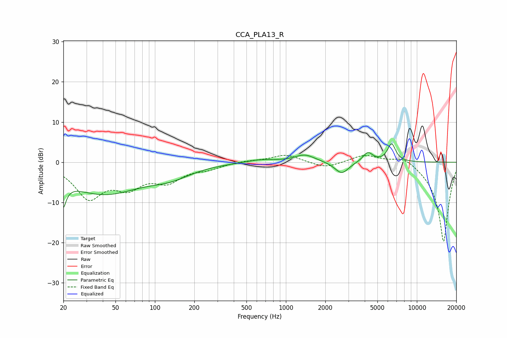

# CCA_PLA13_R
See [usage instructions](https://github.com/jaakkopasanen/AutoEq#usage) for more options and info.

### Parametric EQs
Apply preamp of -4.7 dB when using parametric equalizer.

|   # | Type    |   Fc (Hz) |    Q |   Gain (dB) |
|-----|---------|-----------|------|-------------|
|   1 | Peaking |        20 | 5.41 |        -5.8 |
|   2 | Peaking |        20 | 5.38 |        -3.3 |
|   3 | Peaking |        20 | 5.99 |         3.1 |
|   4 | Peaking |        40 | 0.47 |        -7.7 |
|   5 | Peaking |       132 | 0.89 |        -2.3 |
|   6 | Peaking |       641 | 1.31 |         0.7 |
|   7 | Peaking |      1393 | 1.8  |         1.9 |
|   8 | Peaking |      2669 | 2.65 |        -3   |
|   9 | Peaking |      4220 | 3.68 |         2.4 |
|  10 | Peaking |      6412 | 4.36 |         4.5 |

### Fixed Band EQs
When using fixed band (also called graphic) equalizer, apply preamp of **-1.8 dB** (if available) and set gains manually with these parameters.

|   # | Type    |   Fc (Hz) |    Q |   Gain (dB) |
|-----|---------|-----------|------|-------------|
|   1 | Peaking |        31 | 1.41 |        -8.4 |
|   2 | Peaking |        62 | 1.41 |        -5.1 |
|   3 | Peaking |       125 | 1.41 |        -4.1 |
|   4 | Peaking |       250 | 1.41 |        -1.3 |
|   5 | Peaking |       500 | 1.41 |         0.4 |
|   6 | Peaking |      1000 | 1.41 |         1.9 |
|   7 | Peaking |      2000 | 1.41 |        -1.5 |
|   8 | Peaking |      4000 | 1.41 |         2   |
|   9 | Peaking |      8000 | 1.41 |         2   |
|  10 | Peaking |     16000 | 1.41 |       -20   |

### Graphs

