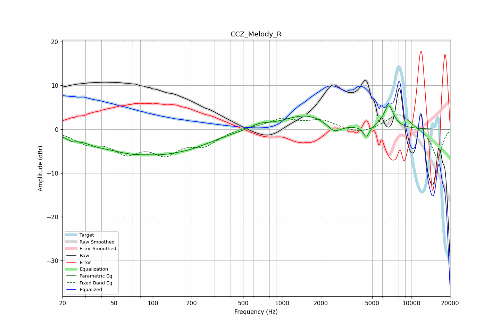

# CCZ_Melody_R
See [usage instructions](https://github.com/jaakkopasanen/AutoEq#usage) for more options and info.

### Parametric EQs
Apply preamp of -5.5 dB when using parametric equalizer.

|   # | Type    |   Fc (Hz) |    Q |   Gain (dB) |
|-----|---------|-----------|------|-------------|
|   1 | Peaking |        24 | 3.9  |        -0.8 |
|   2 | Peaking |        36 | 1.82 |        -0.6 |
|   3 | Peaking |        86 | 0.45 |        -5.9 |
|   4 | Peaking |        89 | 1.75 |         0.4 |
|   5 | Peaking |       212 | 0.86 |        -1.3 |
|   6 | Peaking |       671 | 2    |         1   |
|   7 | Peaking |      1531 | 0.81 |         3.3 |
|   8 | Peaking |      2541 | 2.6  |        -2.2 |
|   9 | Peaking |      4502 | 6    |        -2.5 |
|  10 | Peaking |      6706 | 3.51 |         5.3 |

### Fixed Band EQs
When using fixed band (also called graphic) equalizer, apply preamp of **-3.4 dB** (if available) and set gains manually with these parameters.

|   # | Type    |   Fc (Hz) |    Q |   Gain (dB) |
|-----|---------|-----------|------|-------------|
|   1 | Peaking |        31 | 1.41 |        -2.7 |
|   2 | Peaking |        62 | 1.41 |        -4.6 |
|   3 | Peaking |       125 | 1.41 |        -4.8 |
|   4 | Peaking |       250 | 1.41 |        -3.2 |
|   5 | Peaking |       500 | 1.41 |         0.4 |
|   6 | Peaking |      1000 | 1.41 |         2.3 |
|   7 | Peaking |      2000 | 1.41 |         1.9 |
|   8 | Peaking |      4000 | 1.41 |        -1.2 |
|   9 | Peaking |      8000 | 1.41 |         3.8 |
|  10 | Peaking |     16000 | 1.41 |        -6.7 |

### Graphs

