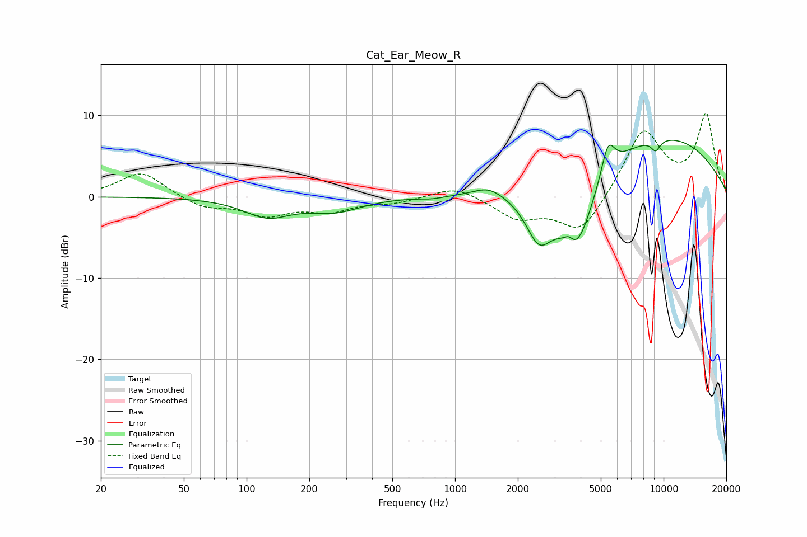

# Cat_Ear_Meow_R
See [usage instructions](https://github.com/jaakkopasanen/AutoEq#usage) for more options and info.

### Parametric EQs
Apply preamp of -7.0 dB when using parametric equalizer.

|   # | Type    |   Fc (Hz) |    Q |   Gain (dB) |
|-----|---------|-----------|------|-------------|
|   1 | Peaking |       126 | 1.25 |        -2.3 |
|   2 | Peaking |       266 | 1.14 |        -1.6 |
|   3 | Peaking |       777 | 2.63 |        -0.3 |
|   4 | Peaking |      1446 | 1.99 |         1.2 |
|   5 | Peaking |      2525 | 2.17 |        -5.6 |
|   6 | Peaking |      3519 | 6    |         1.1 |
|   7 | Peaking |      3809 | 1.59 |        -9.5 |
|   8 | Peaking |      5416 | 4.22 |         4.1 |
|   9 | Peaking |      9168 | 5.76 |        -1.4 |
|  10 | Peaking |      9308 | 0.33 |         7.7 |

### Fixed Band EQs
When using fixed band (also called graphic) equalizer, apply preamp of **-10.4 dB** (if available) and set gains manually with these parameters.

|   # | Type    |   Fc (Hz) |    Q |   Gain (dB) |
|-----|---------|-----------|------|-------------|
|   1 | Peaking |        31 | 1.41 |         3.1 |
|   2 | Peaking |        62 | 1.41 |        -1.3 |
|   3 | Peaking |       125 | 1.41 |        -2.1 |
|   4 | Peaking |       250 | 1.41 |        -1.5 |
|   5 | Peaking |       500 | 1.41 |        -0.7 |
|   6 | Peaking |      1000 | 1.41 |         1.4 |
|   7 | Peaking |      2000 | 1.41 |        -2.5 |
|   8 | Peaking |      4000 | 1.41 |        -4.6 |
|   9 | Peaking |      8000 | 1.41 |         8.2 |
|  10 | Peaking |     16000 | 1.41 |         9.9 |

### Graphs

