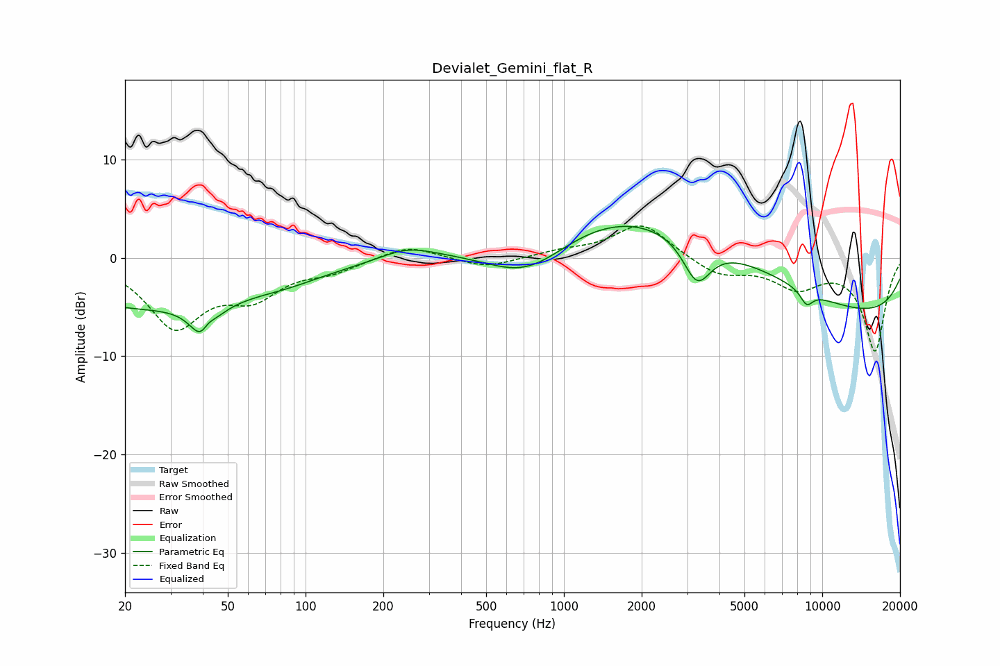

# Devialet_Gemini_flat_R
See [usage instructions](https://github.com/jaakkopasanen/AutoEq#usage) for more options and info.

### Parametric EQs
Apply preamp of -3.3 dB when using parametric equalizer.

|   # | Type    |   Fc (Hz) |    Q |   Gain (dB) |
|-----|---------|-----------|------|-------------|
|   1 | Peaking |        25 | 0.29 |        -5   |
|   2 | Peaking |        40 | 3.41 |        -5.7 |
|   3 | Peaking |        41 | 4.58 |         3.3 |
|   4 | Peaking |        87 | 1.21 |        -0.4 |
|   5 | Peaking |       247 | 1.39 |         1.1 |
|   6 | Peaking |       723 | 0.76 |        -5.6 |
|   7 | Peaking |      2059 | 0.26 |         8   |
|   8 | Peaking |      3276 | 2.59 |        -4.5 |
|   9 | Peaking |      8699 | 5.16 |        -1.4 |
|  10 | Peaking |      9854 | 0.18 |        -6.5 |

### Fixed Band EQs
When using fixed band (also called graphic) equalizer, apply preamp of **-3.3 dB** (if available) and set gains manually with these parameters.

|   # | Type    |   Fc (Hz) |    Q |   Gain (dB) |
|-----|---------|-----------|------|-------------|
|   1 | Peaking |        31 | 1.41 |        -6.7 |
|   2 | Peaking |        62 | 1.41 |        -3.3 |
|   3 | Peaking |       125 | 1.41 |        -1.1 |
|   4 | Peaking |       250 | 1.41 |         1.4 |
|   5 | Peaking |       500 | 1.41 |        -1.1 |
|   6 | Peaking |      1000 | 1.41 |         0.6 |
|   7 | Peaking |      2000 | 1.41 |         3.5 |
|   8 | Peaking |      4000 | 1.41 |        -1.7 |
|   9 | Peaking |      8000 | 1.41 |        -2.7 |
|  10 | Peaking |     16000 | 1.41 |        -9.4 |

### Graphs

