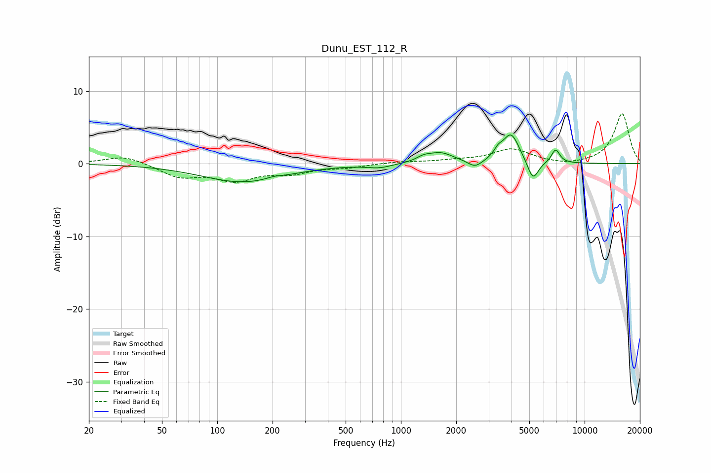

# Dunu_EST_112_R
See [usage instructions](https://github.com/jaakkopasanen/AutoEq#usage) for more options and info.

### Parametric EQs
Apply preamp of -4.0 dB when using parametric equalizer.

|   # | Type    |   Fc (Hz) |    Q |   Gain (dB) |
|-----|---------|-----------|------|-------------|
|   1 | Peaking |       138 | 0.63 |        -2.5 |
|   2 | Peaking |       204 | 3.44 |         0.3 |
|   3 | Peaking |       762 | 2.12 |        -0.5 |
|   4 | Peaking |      1329 | 3.8  |         0.5 |
|   5 | Peaking |      1642 | 1.96 |         1.4 |
|   6 | Peaking |      2532 | 3.67 |        -1   |
|   7 | Peaking |      3382 | 6    |         0.9 |
|   8 | Peaking |      3976 | 3.09 |         4   |
|   9 | Peaking |      5233 | 4.66 |        -2.8 |
|  10 | Peaking |      6954 | 5.99 |         1.9 |

### Fixed Band EQs
When using fixed band (also called graphic) equalizer, apply preamp of **-6.9 dB** (if available) and set gains manually with these parameters.

|   # | Type    |   Fc (Hz) |    Q |   Gain (dB) |
|-----|---------|-----------|------|-------------|
|   1 | Peaking |        31 | 1.41 |         1.1 |
|   2 | Peaking |        62 | 1.41 |        -1.7 |
|   3 | Peaking |       125 | 1.41 |        -2.1 |
|   4 | Peaking |       250 | 1.41 |        -1.1 |
|   5 | Peaking |       500 | 1.41 |        -0.5 |
|   6 | Peaking |      1000 | 1.41 |         0.3 |
|   7 | Peaking |      2000 | 1.41 |         0.3 |
|   8 | Peaking |      4000 | 1.41 |         1.9 |
|   9 | Peaking |      8000 | 1.41 |        -0.3 |
|  10 | Peaking |     16000 | 1.41 |         6.9 |

### Graphs

