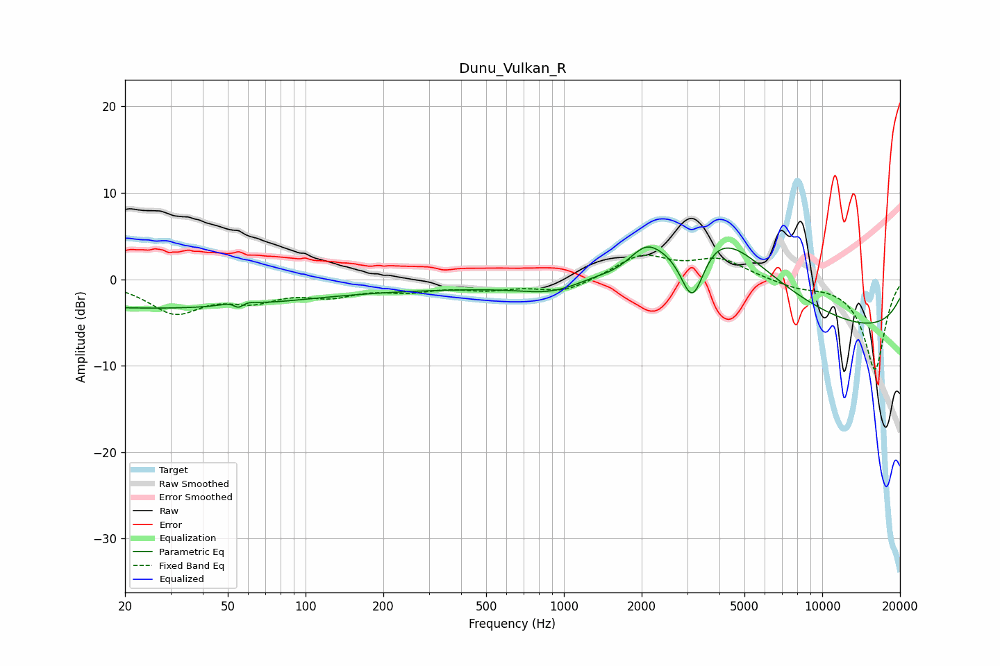

# Dunu_Vulkan_R
See [usage instructions](https://github.com/jaakkopasanen/AutoEq#usage) for more options and info.

### Parametric EQs
Apply preamp of -3.8 dB when using parametric equalizer.

|   # | Type    |   Fc (Hz) |    Q |   Gain (dB) |
|-----|---------|-----------|------|-------------|
|   1 | Peaking |        20 | 0.23 |        -3.1 |
|   2 | Peaking |        55 | 4.41 |         2.2 |
|   3 | Peaking |        55 | 5.88 |        -2.4 |
|   4 | Peaking |       226 | 0.2  |        -1.1 |
|   5 | Peaking |       918 | 1.1  |        -1.6 |
|   6 | Peaking |      1580 | 2.21 |        -0.5 |
|   7 | Peaking |      2078 | 2.58 |         1.6 |
|   8 | Peaking |      3145 | 2.74 |        -8.2 |
|   9 | Peaking |      3661 | 0.6  |        11.7 |
|  10 | Peaking |     10000 | 0.18 |        -6.5 |

### Fixed Band EQs
When using fixed band (also called graphic) equalizer, apply preamp of **-2.9 dB** (if available) and set gains manually with these parameters.

|   # | Type    |   Fc (Hz) |    Q |   Gain (dB) |
|-----|---------|-----------|------|-------------|
|   1 | Peaking |        31 | 1.41 |        -3.6 |
|   2 | Peaking |        62 | 1.41 |        -2   |
|   3 | Peaking |       125 | 1.41 |        -1.6 |
|   4 | Peaking |       250 | 1.41 |        -1.1 |
|   5 | Peaking |       500 | 1.41 |        -0.9 |
|   6 | Peaking |      1000 | 1.41 |        -1.5 |
|   7 | Peaking |      2000 | 1.41 |         2.7 |
|   8 | Peaking |      4000 | 1.41 |         2.2 |
|   9 | Peaking |      8000 | 1.41 |        -0.8 |
|  10 | Peaking |     16000 | 1.41 |       -10.5 |

### Graphs

